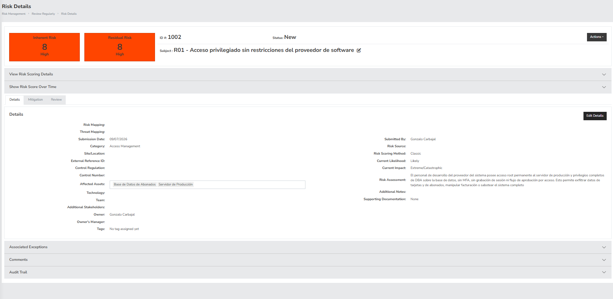
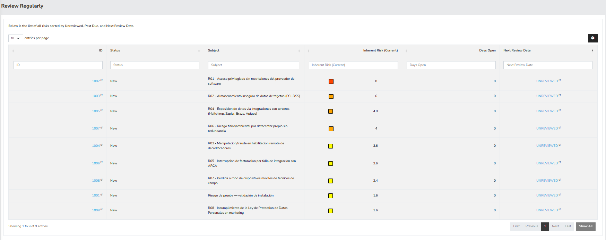
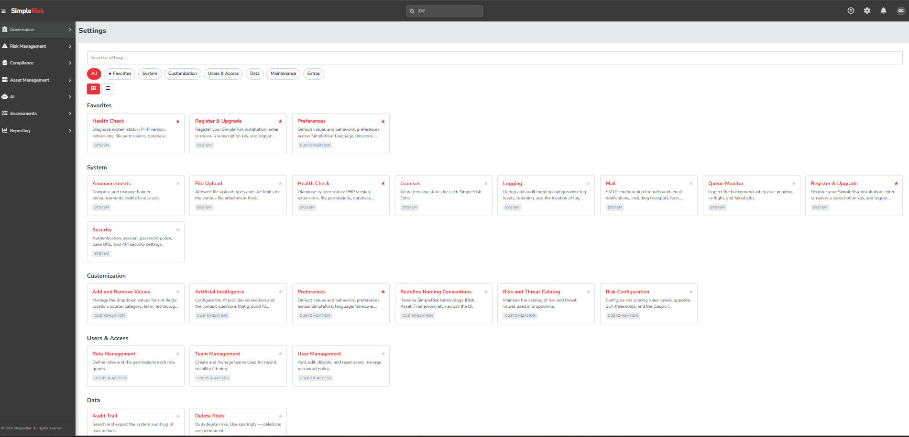

# Informe del TP: Gestión de Riesgos con SimpleRisk

## Parte A — Instalación y Configuración Básica

### Instalación

SimpleRisk se instaló mediante Docker Compose, usando la imagen oficial
`simplerisk/simplerisk:latest` (ver `entorno/docker-compose.yml`). El servicio se publica
en `https://localhost:8444/` (HTTPS) y `http://localhost:8081/` (redirige a HTTPS). Se
usaron puertos no estándar (8081/8444 en lugar de 80/443) porque el puerto 80 ya estaba
ocupado por otro proceso en el host de desarrollo.

Pasos: `docker compose up -d` desde `entorno/`, y completar el asistente inicial
("Default Admin Account Creation") con credenciales ficticias.

### Usuarios y roles

Se crearon 3 usuarios con roles diferenciados (detalle completo en
`configuracion/usuarios.md`):

- `admin_demo` — rol **Administrator** (nativo de SimpleRisk).
- `analista_demo` — rol custom **Analista de Riesgos**, creado en *Settings → Role
  Management* con permisos operativos sobre Risk Management (alta/modificación de
  riesgos, planificación y aceptación de mitigaciones, gestión de proyectos) y acceso a
  Asset Management. Sin permisos administrativos.
- `auditor_demo` — rol custom **Auditor**, con permisos de solo revisión/comentario sobre
  riesgos (sin crear, modificar ni cerrar) y acceso al módulo Compliance (iniciar/modificar
  auditorías, aprobar tests) más vista de excepciones en Governance.

Los roles custom se diseñaron aplicando el principio de mínimo privilegio: cada uno tiene
únicamente los permisos necesarios para su función, evitando que el analista pueda auditar
su propio trabajo con permisos de administrador ni que el auditor pueda alterar el registro
de riesgos que está revisando (segregación de funciones).

### Riesgo de prueba

Se creó un riesgo de prueba ("Riesgo de prueba — validación de instalación", ID #1001)
para validar el funcionamiento end-to-end de la instalación. Resultado: riesgo Inherente y
Residual de 1.6 (Low), coherente con los valores de Likelihood "Unlikely" e Impact "Minor"
cargados — confirma que el motor de scoring de SimpleRisk funciona correctamente.

## Parte B — Escenario Real (Cliente SIGA)

### Contexto

**Cable Sur S.A.** (nombre ficticio; representativo de un cliente real de ICITELCO — se
anonimiza porque el repositorio de este TP es público) es una empresa de triple play
(televisión por cable, internet y telefonía) en una ciudad del interior de Argentina, con
~90 empleados y ~45.000 abonados activos. Utiliza **SIGA**, el sistema integrado de
gestión de abonados de ICITELCO, instalado **on-premise** en un datacenter propio ubicado
en sus oficinas centrales.

Módulos de SIGA en uso: gestión de abonados y decodificadores (habilitación/deshabilitación
remota), órdenes técnicas (instalación, mudanza, desconexión, avería), facturación
(integrada con **ARCA** —ex AFIP— para la obtención de CAE), cobranza (Cajas, Débitos y
Recibos, con débito automático de tarjetas de crédito/débito), y marketing (integraciones
con Mailchimp, Braze, Zapier y Apigee para envío de campañas y facturas por email).

El proveedor (ICITELCO) mantiene acceso remoto de soporte con privilegios de
administrador root sobre el servidor de producción y privilegios completos de DBA sobre
la base de datos, sin un esquema formal de acceso privilegiado (PAM). Una auditoría
externa reciente identificó debilidades en la gestión de riesgos de Cable Sur, lo que
motiva este registro inicial.

Se eligió un escenario **on-premise** (en lugar de nube) porque expone una superficie de
riesgo más completa y realista para este análisis: continuidad física del datacenter,
gestión de accesos privilegiados de terceros, y dependencia de integraciones externas.

### Riesgos identificados

**R01 — Acceso privilegiado sin restricciones del proveedor de software**
Descripción: el personal de desarrollo de ICITELCO posee acceso root permanente al
servidor de producción y privilegios completos de DBA sobre la base de datos, sin MFA,
sin grabación de sesión ni flujo de aprobación por acceso.
Categoría: Confidencialidad / Integridad / Riesgo de terceros.
Activos afectados: servidor de producción, base de datos de abonados y facturación.
Probabilidad: **4 (Probable)** — el acceso está disponible de forma permanente y sin
monitoreo activo; según el Verizon DBIR, el abuso de accesos legítimos y el riesgo de
terceros/proveedores están entre las causas más frecuentes de incidentes.
Impacto: **5 (Catastrófico)** — ese nivel de acceso permite exfiltrar datos de tarjetas y
de abonados, manipular facturación o sabotear el sistema completo.
Nivel: **20 — Crítico**.
Controles existentes: ninguno formal más allá de la relación contractual con el proveedor.
Tratamiento: **Mitigar** — implementar PAM (MFA, sesión grabada, aprobación just-in-time,
mínimo privilegio), con revisión periódica de accesos.
Propietario: Gerente de IT de Cable Sur.

**R02 — Almacenamiento inseguro de datos de tarjetas de crédito/débito**
Descripción: el módulo de Cobranza gestiona datos de tarjeta de los abonados para
generar débitos automáticos mensuales; si se almacenan sin tokenización/cifrado conforme
a PCI-DSS, quedan expuestos ante cualquier acceso indebido a la base.
Categoría: Confidencialidad / Legal (PCI-DSS, Ley 25.326).
Activos afectados: base de datos de Cobranza (Cajas/Débitos/Recibos).
Probabilidad: **3 (Posible)** — sistemas de gestión de abonados de este tipo no siempre
implementan tokenización completa por defecto.
Impacto: **5 (Catastrófico)** — exposición masiva de datos financieros, sanciones y
pérdida de confianza de abonados y entidades bancarias.
Nivel: **15 — Alto**.
Controles existentes: integración con entidades de cobranza (posible tokenización
parcial, a confirmar con el equipo de Cable Sur).
Tratamiento: **Mitigar** — migrar a tokenización vía pasarela de pago certificada
PCI-DSS, eliminando el PAN completo de la base de SIGA.
Propietario: CISO / Responsable de Seguridad de la Información.

**R03 — Manipulación/fraude en habilitación remota de decodificadores**
Descripción: el sistema permite habilitar/deshabilitar decodificadores en forma remota;
un acceso indebido podría habilitar servicio sin pago (fraude) o deshabilitar
decodificadores de abonados legítimos.
Categoría: Integridad / Operativo.
Activos afectados: módulo de gestión de decoders, ingresos por suscripción.
Probabilidad: **3 (Posible)**.
Impacto: **3 (Moderado)** — pérdida de ingresos puntual y reclamos de clientes,
recuperable.
Nivel: **9 — Medio**.
Controles existentes: autenticación básica de operadores internos.
Tratamiento: **Mitigar** — auditoría detallada por operación, alertas de habilitaciones
anómalas, reconciliación periódica facturación vs. decoders activos.
Propietario: Jefe de Operaciones Técnicas.

**R04 — Exposición de datos vía integraciones con terceros**
Descripción: SIGA envía datos de contacto y facturación a proveedores externos
(Mailchimp, Braze, Zapier, Apigee) para marketing y automatización; credenciales/API
keys mal gestionadas ampliarían la superficie de exposición.
Categoría: Confidencialidad / Cadena de suministro.
Activos afectados: datos de contacto/facturación de abonados, API keys.
Probabilidad: **3 (Posible)** — múltiples integraciones amplían la superficie de ataque;
el riesgo de cadena de suministro es una de las categorías de mayor crecimiento según el
Verizon DBIR.
Impacto: **4 (Mayor)** — filtración de datos de miles de abonados por un proveedor
comprometido.
Nivel: **12 — Alto**.
Controles existentes: proveedores reconocidos con sus propios controles, pero sin
evidencia de gestión centralizada de secretos.
Tratamiento: **Mitigar** — vault de gestión de secretos, rotación periódica de API keys,
revisión de acuerdos DPA, minimización de datos enviados.
Propietario: Responsable de Sistemas / Integraciones.

**R05 — Interrupción de facturación por falla de integración con ARCA**
Descripción: la emisión de comprobantes depende de la conexión en línea con ARCA para
obtener el CAE; una caída del servicio o de la conectividad interrumpe la facturación.
Categoría: Disponibilidad / Legal.
Activos afectados: módulo de Facturación.
Probabilidad: **3 (Posible)** — dependencia de un servicio externo con caídas
históricamente documentadas.
Impacto: **3 (Moderado)** — demoras en la facturación, con mecanismos de contingencia
regulatoria (CAE por lote posterior) que acotan el daño.
Nivel: **9 — Medio**.
Controles existentes: ninguno formal de contingencia identificado.
Tratamiento: **Mitigar** — cola de reintentos automáticos y procedimiento manual de
contingencia documentado.
Propietario: Responsable de Facturación / Administración.

**R06 — Riesgo físico/ambiental por datacenter propio sin redundancia**
Descripción: SIGA y su base de datos residen en un datacenter propio en las oficinas
centrales de Cable Sur, sin sitio de contingencia ni redundancia geográfica.
Categoría: Disponibilidad / Continuidad de negocio.
Activos afectados: todo el sistema SIGA (servidor y base de datos de producción).
Probabilidad: **2 (Improbable)** en el corto plazo, pero no despreciable en un horizonte
de varios años.
Impacto: **5 (Catastrófico)** — un incendio, inundación o corte eléctrico prolongado deja
fuera de servicio toda la operación (facturación, atención al cliente, gestión técnica)
simultáneamente.
Nivel: **10 — Alto**.
Controles existentes: UPS básico (a confirmar), sin sitio alterno documentado.
Tratamiento: **Mitigar** — plan de continuidad de negocio (BCP/DR), backups automatizados
con copia off-site, y revisión de la ubicación física del datacenter.
Propietario: Gerente de IT / Infraestructura.

**R07 — Pérdida o robo de dispositivos móviles de técnicos de campo**
Descripción: los técnicos acceden a datos de abonados (dirección, contacto, a veces
facturación) desde dispositivos móviles en campo; la pérdida o robo sin cifrado expone
esos datos.
Categoría: Confidencialidad / Operativo.
Activos afectados: dispositivos móviles de técnicos, datos de contacto de abonados.
Probabilidad: **3 (Posible)** — los dispositivos en campo están más expuestos a pérdida o
robo que los equipos de oficina.
Impacto: **2 (Menor)** — el acceso queda acotado a los datos de la orden de trabajo
asignada, no al sistema completo.
Nivel: **6 — Medio**.
Controles existentes: login individual por técnico.
Tratamiento: **Mitigar** — cifrado de dispositivo, gestión MDM con bloqueo remoto, sesión
con expiración corta.
Propietario: Jefe de Operaciones Técnicas.

**R08 — Incumplimiento de la Ley de Protección de Datos Personales en marketing**
Descripción: las campañas de marketing reutilizan datos de contacto/facturación de
abonados; sin gestión adecuada de consentimiento y opt-out hay riesgo de incumplir la Ley
25.326.
Categoría: Legal / Reputacional.
Activos afectados: base de contacto de abonados, reputación de la empresa.
Probabilidad: **2 (Improbable)** — no es habitual una auditoría proactiva de la AAIP
sobre una PyME, salvo denuncia puntual.
Impacto: **2 (Menor)** — sanciones económicas moderadas, impacto más reputacional que
financiero directo.
Nivel: **4 — Bajo**.
Controles existentes: mecanismo de opt-out estándar de Mailchimp/Braze.
Tratamiento: **Aceptar** (con monitoreo) — se mantiene el control existente y se agenda
una revisión legal periódica de los consentimientos.
Propietario: Responsable de Marketing / Legal.

### Planes de acción (riesgos Alto/Crítico)

Ver tabla completa en `configuracion/riesgos.md`. Resumen:

1. **R01 (Crítico):** Implementar acceso privilegiado seguro (PAM) para el proveedor —
   Gerente de IT, vencimiento 2026-11-30, USD 8.000.
2. **R02 (Alto):** Migrar a tokenización PCI-DSS de datos de tarjeta — CISO, vencimiento
   2027-02-28, USD 15.000.
3. **R06 (Alto):** Plan de Continuidad de Negocio + backups off-site — Gerente de
   IT/Infraestructura, vencimiento 2027-01-15, USD 6.000/año.

### Capturas







> Nota: se recorta la barra de marcadores del navegador en capturas futuras — en esta
> quedó visible por error y no debería mostrar contenido personal/laboral ajeno al TP.

### Nota metodológica: score de SimpleRisk vs. matriz de justificación propia

Al cargar los 8 riesgos se observó que el **score interno "Classic" de SimpleRisk** no
coincide con la clasificación Bajo/Medio/Alto/Crítico usada en la tabla de justificación
de este informe (basada en la matriz clásica P×I 1-25, con los mismos rangos del material
de cátedra: Bajo 1-4, Medio 5-9, Alto 10-15, Crítico 16-25). SimpleRisk aplica
internamente `calculated_risk = likelihood × impact × 0.4` y clasifica con umbrales
propios (`Low` <4, `Medium` 4-7, `High` 7-10.1, `Very High` ≥10.1) — un factor de escala y
unos cortes que **no están documentados en la interfaz** y que un usuario no
técnico difícilmente pueda inferir. Por ejemplo, R01 (que en nuestra matriz justificada es
"Crítico", valor 20/25) aparece en SimpleRisk como **"High"**, y ningún riesgo del
registro llega a "Very High" pese a existir un riesgo catastrófico con probabilidad alta.
Este hallazgo se retoma como argumento concreto en la Parte C (comparación
metodológica): la falta de transparencia/configurabilidad del modelo "Classic" es una
limitación real frente a metodologías como FAIR, que expresan el riesgo en términos
auditable y con supuestos explícitos. Las decisiones de tratamiento de este TP se basan
en **la matriz propia, documentada y justificada** (`configuracion/riesgos.md`), no en el
score bruto que muestra la herramienta.

## Parte C — Análisis Crítico y Profundización

### Comparación metodológica: SimpleRisk (Classic P×I) vs. FAIR

**SimpleRisk (modelo "Classic")** clasifica el riesgo con una matriz cualitativa de
Probabilidad × Impacto en escala 1-5, multiplicando ambos valores y aplicando un factor de
escala interno (`× 0.4`, ver nota metodológica de la Parte B) para ubicar el resultado en
cuatro bandas (Low/Medium/High/Very High). Es el modelo más difundido en la práctica
porque es rápido de aplicar y no requiere datos históricos.

**FAIR (Factor Analysis of Information Risk)** es un modelo **cuantitativo**: en vez de
una escala ordinal 1-5, descompone el riesgo en factores medibles —Frecuencia de Amenaza
(TEF), Vulnerabilidad, Frecuencia de Pérdida (LEF), y Magnitud de Pérdida Probable
(PLM)— y expresa el resultado como una **distribución de pérdida económica esperada**
(ej. "entre USD 50.000 y USD 300.000 anuales, con 90% de confianza"), típicamente mediante
simulación de Montecarlo.

| Aspecto | SimpleRisk (Classic) | FAIR |
|---|---|---|
| Naturaleza | Cualitativa/ordinal (1-5) | Cuantitativa (rangos monetarios, probabilidad estadística) |
| Insumos necesarios | Criterio experto del analista | Datos históricos, tasas de incidentes, valuación de activos |
| Velocidad de aplicación | Alta — se carga un riesgo en minutos | Baja — requiere modelado y calibración por riesgo |
| Comparabilidad entre riesgos | Limitada — "Alto" de un riesgo no es necesariamente comparable en magnitud real con "Alto" de otro | Alta — todo se expresa en la misma unidad (USD esperados), permite priorizar por ROI de mitigación |
| Transparencia del cálculo | Baja en la práctica: la fórmula y los umbrales de nivel no son evidentes para el usuario final (ver hallazgo de la Parte B) | Alta — cada factor y su fuente quedan documentados explícitamente |
| Curva de aprendizaje | Baja | Alta — requiere formación específica (FAIR Institute certifica analistas) |
| Costo de implementación | Bajo (herramienta gratuita, sin insumos externos) | Alto (tiempo de analista, datos actuariales/de mercado) |

**¿Cuándo conviene cada una?** Para una organización como Cable Sur (90 empleados, sin
área de riesgo dedicada), la matriz Classic de SimpleRisk es la opción **pragmática**: da
un registro de riesgos accionable en poco tiempo y con el conocimiento del propio personal
de IT, sin requerir un analista FAIR certificado ni datos actuariales que la empresa no
tiene. FAIR sería preferible para los riesgos de mayor magnitud del propio registro —por
ejemplo, **R01** (acceso privilegiado del proveedor) o **R02** (datos de tarjetas,
PCI-DSS)— si la dirección necesitara justificar ante el directorio una inversión
concreta (¿vale la pena gastar USD 8.000 en un PAM?) con una cifra de pérdida evitada en
lugar de una etiqueta cualitativa "Crítico". En síntesis: Classic para el **registro
inicial completo** (rapidez, cobertura), FAIR para un **análisis de profundidad** sobre
los 2-3 riesgos de mayor impacto económico potencial, antes de aprobar presupuesto.

### Integración con herramienta externa

Se documenta (y se implementó, ver D2 en la Parte D) una integración de **notificación de
riesgos altos vía webhook**, con Discord como destino de prueba (el mismo mecanismo aplica
sin cambios a Slack o Microsoft Teams, que aceptan el mismo tipo de payload JSON simple).

**Arquitectura de la integración (`scripts/notify_high_risks.sh`):**

```
[Base de datos de SimpleRisk] --(SELECT via mysql client)--> [script bash]
        --(POST JSON)--> [Webhook de Discord/Slack/Teams] --> [Canal del equipo de seguridad]
```

Se consulta directamente la base de datos (no la API REST, que es un "Extra" pago no
disponible en la versión Community — ver Parte D) filtrando riesgos cuyo `calculated_risk`
supera el umbral "High" definido dinámicamente en la tabla `risk_levels` del propio
sistema, y se envía un mensaje por cada uno al canal configurado.

**Alternativa para un entorno productivo real (SIEM):** si Cable Sur tuviera un SIEM
(Splunk, Elastic, Wazuh), la integración recomendada no sería un webhook puntual sino:

1. Exportar periódicamente la tabla `audit_log`/`risks` de SimpleRisk (o, si se paga el
   Extra, consumir la API REST) hacia un pipeline de ingesta (Filebeat/Logstash) que
   normalice los eventos a un formato común (CEF/JSON).
2. Correlacionar en el SIEM los riesgos "Crítico"/"Very High" del registro de gestión de
   riesgos con alertas de seguridad operativas (ej. intentos de acceso fallidos al
   servidor de producción del riesgo R01), para detectar cuándo un riesgo teórico se está
   materializando en tiempo real.
3. Generar un ticket automático en un sistema de gestión (Jira/ServiceNow) por cada riesgo
   nuevo de nivel Alto/Crítico, asignado al propietario documentado en `riesgos.md`, en
   vez de depender de que alguien revise el dashboard manualmente.

Esta arquitectura extendida no se implementó en este TP (excede el alcance de un webhook
de demostración), pero queda documentada como el camino de evolución natural del
prototipo de D2.

## Parte D — Actividades Optativas

### D3 — Automatización de la carga de riesgos (Docker Compose + script de seed)

Se evaluó primero automatizar la carga vía la **API REST de SimpleRisk**, pero se
comprobó que en la versión Community (imagen Docker usada en este TP) el acceso a la API
es una funcionalidad paga ("API Extra", visible en *Settings → Extras* con botón
"Purchase"); un `curl` autenticado contra `/api/v2/documentation.php` devuelve `401`. Se
documenta esto como hallazgo honesto en vez de forzar una vía no disponible.

Como alternativa —habilitada explícitamente por el enunciado— se automatizó la carga
mediante dos scripts SQL:

- `scripts/seed_risks.sql`: inserta directamente en las tablas internas de SimpleRisk
  (`assets`, `risks`, `risk_scoring`, `risks_to_assets`) los 8 riesgos del registro, sus
  valores de probabilidad/impacto y sus activos afectados.
- `scripts/seed_action_plans.sql`: inserta los 3 planes de acción (tabla `projects`, con
  título, vencimiento y responsable) y sus mitigaciones asociadas (tabla `mitigations`,
  con estrategia, esfuerzo, costo estimado y recomendación), vinculándolos a los riesgos
  R01, R02 y R06 (los de nivel Alto/Crítico) mediante `risks.project_id` y
  `risks.mitigation_id`.

Características del script:
- **Idempotente**: cada INSERT está guardado con `WHERE NOT EXISTS` sobre una clave de
  negocio (nombre de activo / subject de riesgo), verificado corriéndolo dos veces sobre
  la misma base sin generar duplicados.
- **Reproducible**: pensado para correr una sola vez sobre una instalación recién
  inicializada de SimpleRisk (después de crear la cuenta de administrador).
- **Uso:**
  ```bash
  docker exec -i simplerisk mysql -h127.0.0.1 -u simplerisk -p"$SIMPLERISK_DB_PASSWORD" \
    simplerisk < scripts/seed_risks.sql
  ```
  La contraseña de la base se obtiene de
  `/var/www/simplerisk/includes/config.php` dentro del contenedor (`DB_PASSWORD`) — se
  genera aleatoriamente por instalación y nunca se versiona en este repositorio.

**Limitación de seguridad relevada (relevante para el análisis crítico):** este método
escribe directamente en la base de datos, **evitando por completo la capa de validación
de la aplicación PHP**. No genera entradas en el audit trail ni en el historial de
scoring que sí se generan al cargar un riesgo desde la interfaz. Es aceptable para poblar
un entorno de demostración/TP reproducible, pero sería un antipatrón de seguridad grave en
un entorno productivo real (bypass de controles de aplicación, ausencia de trazabilidad).
Irónicamente, esto es un paralelismo directo con el riesgo **R01** del propio registro:
tanto este script como el acceso root del proveedor logran lo mismo — control total sobre
los datos sin pasar por los controles de la aplicación.

### D2 — Integración real (webhook)

_Pendiente — ver Parte C para el diseño de la integración._
