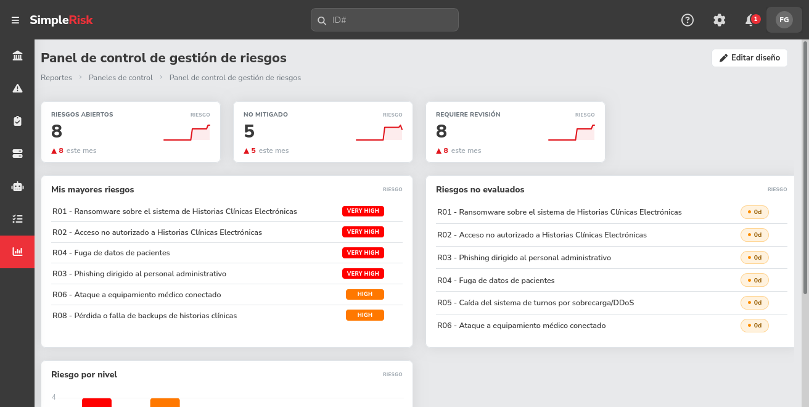
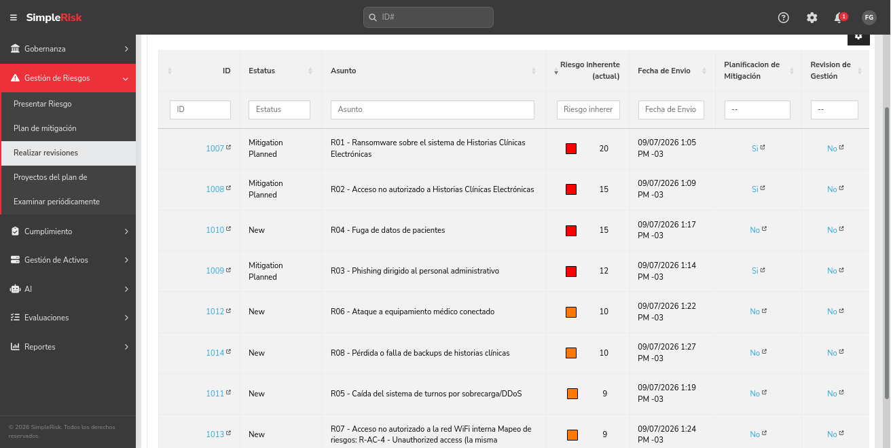
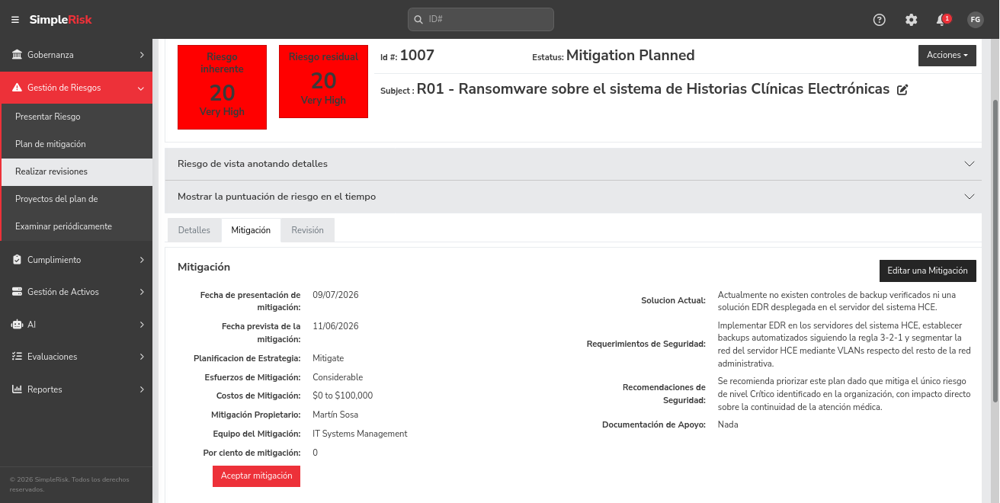

# Informe del Trabajo Práctico - Gestión de Riesgos con SimpleRisk

## Introducción

Este informe documenta el desarrollo del trabajo práctico de gestión de riesgos utilizando SimpleRisk, aplicado al escenario de la Clínica San Rafael.

La organización planteada es una clínica privada de 120 empleados que atiende aproximadamente 800 pacientes por día y utiliza sistemas informáticos para manejar historias clínicas digitales, información de obras sociales, facturación y otros procesos relacionados con la atención de los pacientes.

A partir de este escenario se identificaron los principales activos y riesgos de seguridad de la información, se evaluó su probabilidad e impacto y se definieron medidas para tratar los riesgos de mayor importancia.

## Parte A - Instalacion y Configuracion Basica

Para este trabajo se instalo SimpleRisk de forma local utilizando Docker, siguiendo
el procedimiento de imagen oficial publicada en DockerHub. Los pasos utilizados
estan documentados en `entorno/setup.sh` y se resumen tambien en el README del
repositorio.

Una vez levantada la instancia, se crearon 3 usuarios con roles diferenciados para
cumplir con lo solicitado en esta parte:

- Un usuario Administrador, con acceso total al sistema.
- Un usuario Analista de Riesgos, con permisos para crear y modificar riesgos y
  planificar mitigaciones.
- Un usuario Auditor, con permisos de solo lectura sobre los riesgos y activos
  cargados.

El detalle completo de estos usuarios, sus roles y permisos especificos se
encuentra documentado en `configuracion/usuarios.md`.

Como primer paso de validacion, se creo un riesgo de prueba en SimpleRisk para
confirmar que el sistema funcionaba correctamente antes de avanzar con la carga
del escenario completo de la Clinica San Rafael, desarrollado en la Parte B.

## Parte B - Implementación en SimpleRisk

Para realizar el trabajo se configuró una instancia local de SimpleRisk y se cargaron:

- 8 activos.
- 8 riesgos.
- 3 planes de mitigación.
- 3 usuarios con roles diferenciados: Administrador, Analista de Riesgos y Auditor.

El detalle completo de los riesgos se encuentra en `configuracion/riesgos.md`, mientras que los usuarios, roles y permisos están documentados en `configuracion/usuarios.md`.

A continuación se muestran algunas capturas de la configuración realizada en SimpleRisk.

### Panel de control de riesgos



En el panel de control se puede observar la distribución general de los riesgos registrados según su nivel y los riesgos con mayor valoración.

Para este trabajo se configuró la escala de SimpleRisk para que coincida con la utilizada por la cátedra. De esta forma, las categorías se interpretan como Bajo, Medio, Alto y Crítico, utilizando una valoración basada en Probabilidad × Impacto.

### Listado completo de riesgos cargados



En esta captura se observan los 8 riesgos definidos para la Clínica San Rafael, junto con su estado y su valoración.

La puntuación utilizada en el trabajo se obtiene multiplicando la Probabilidad por el Impacto, utilizando una escala de 1 a 5 para cada variable.

Los niveles utilizados son:

- 1 a 4: Bajo.
- 5 a 9: Medio.
- 10 a 15: Alto.
- 16 a 25: Crítico.

El riesgo con mayor valoración es R01 - Ransomware sobre HCE, con una Probabilidad de 4 y un Impacto de 5, obteniendo un valor de 20 y quedando clasificado como Crítico.

### Plan de mitigación del riesgo R01 - Ransomware sobre HCE



En esta captura se muestra el plan de mitigación correspondiente a R01, el único riesgo clasificado como Crítico.

El tratamiento propuesto incluye la implementación de una estrategia de backups 3-2-1, protección EDR y segmentación de red.

También se definieron el responsable, la fecha prevista de implementación y un presupuesto estimado en dólares estadounidenses.

Este plan fue priorizado debido al impacto que tendría una indisponibilidad de las historias clínicas electrónicas sobre la atención diaria de la clínica.

Los presupuestos utilizados en los planes de mitigación son valores estimativos expresados en dólares estadounidenses (USD) y fueron definidos únicamente con fines académicos para mantener una referencia monetaria uniforme dentro del escenario simulado.

## Parte C - Análisis Crítico

### Comparación Metodológica: SimpleRisk vs. NIST SP 800-30

Para este trabajo se configuró SimpleRisk utilizando una matriz de Probabilidad × Impacto, con valores de 1 a 5 para cada variable. A partir de la multiplicación de ambos valores se obtiene una puntuación entre 1 y 25, que permite clasificar los riesgos como Bajo, Medio, Alto o Crítico.

Este método es bastante simple de aplicar y permite tener rápidamente una visión general de cuáles son los riesgos que requieren mayor atención.

Por otro lado, NIST SP 800-30 propone un proceso de evaluación de riesgos más detallado. Antes de determinar el nivel de riesgo, plantea identificar las fuentes de amenaza, los posibles eventos de amenaza, las vulnerabilidades, las condiciones que pueden favorecer un incidente y el impacto que tendría sobre la organización.

La principal diferencia es que la matriz utilizada en SimpleRisk para este trabajo permite llegar rápidamente a una valoración numérica, mientras que NIST SP 800-30 pone más énfasis en documentar cómo se llegó a esa valoración.

**Ventajas del enfoque utilizado en SimpleRisk:**
- Es rápido de implementar y fácil de entender.
- Permite ordenar y priorizar los riesgos de forma sencilla.
- La representación visual de los niveles facilita comunicar los resultados a personas que no necesariamente tienen conocimientos técnicos.
- Permite mantener en un mismo sistema los riesgos, responsables y planes de mitigación.

**Desventajas del enfoque utilizado en SimpleRisk:**
- La asignación de Probabilidad e Impacto depende bastante del criterio del analista.
- Dos riesgos diferentes pueden terminar con la misma puntuación aunque sus consecuencias sean distintas.
- Una matriz numérica por sí sola no obliga a analizar en detalle cómo podría producirse cada incidente.
- Si las justificaciones no están bien documentadas, la valoración puede resultar demasiado subjetiva.

**Ventajas de NIST SP 800-30:**
- Propone un análisis más detallado de amenazas, vulnerabilidades e impactos.
- Obliga a dejar mejor documentado el razonamiento utilizado para evaluar cada riesgo.
- Permite analizar con mayor profundidad quién o qué puede generar una amenaza y qué condiciones hacen posible el incidente.
- Es útil en organizaciones que necesitan realizar evaluaciones de riesgo más formales y justificables ante auditorías.

**Desventajas de NIST SP 800-30:**
- Requiere más tiempo para realizar cada evaluación.
- Necesita mayor conocimiento técnico y metodológico.
- No es una herramienta de software, sino una guía para realizar evaluaciones de riesgo.
- Para una organización que recién empieza a formalizar su gestión de riesgos puede resultar más complejo de aplicar completamente.

### Contexto de aplicación

En el caso de la Clínica San Rafael, considero que el enfoque utilizado en SimpleRisk es adecuado como punto de partida.

Según el escenario planteado, la clínica comienza a formalizar su gestión de riesgos luego de que una auditoría externa detectara distintas debilidades. Utilizar una matriz de Probabilidad × Impacto permite registrar rápidamente los riesgos, ordenarlos según su importancia y definir planes de tratamiento para los más relevantes.

NIST SP 800-30 sería útil en una etapa posterior o para analizar con mayor profundidad determinados riesgos críticos, especialmente aquellos relacionados con historias clínicas, datos personales de salud o sistemas que puedan afectar directamente la atención de los pacientes.

Incluso podrían utilizarse ambos enfoques de forma complementaria: SimpleRisk para mantener el registro general y seguimiento de los riesgos, y una metodología más detallada como NIST SP 800-30 para estudiar aquellos riesgos que requieran un análisis más profundo.

### Integración con Herramientas Externas

Para complementar la gestión de riesgos, se propone integrar SimpleRisk con Slack, utilizando Microsoft Teams como una alternativa equivalente.

La idea es que el equipo responsable de seguridad reciba una notificación automática cuando aparezca un riesgo nuevo de nivel Alto o Crítico, o cuando un riesgo existente aumente su nivel.

#### Arquitectura propuesta

```text
SimpleRisk
    |
    v
Servicio puente o script de integración
    |
    v
Webhook entrante de Slack
    |
    v
Canal #seguridad-riesgos
```

#### Funcionamiento propuesto

1. Un script consulta periódicamente la información de riesgos almacenada en SimpleRisk.
2. Para realizar esta consulta se podría utilizar la API de SimpleRisk. Algunas funcionalidades de la API pueden requerir el módulo adicional **API Extra**, por lo que antes de realizar una implementación real habría que verificar que este módulo se encuentre disponible y habilitado en la instalación.
3. El script podría ejecutarse, por ejemplo, cada 15 minutos y comparar los riesgos obtenidos con la información de la consulta anterior.
4. Si detecta un riesgo nuevo o uno que pasó a nivel Alto o Crítico, prepara una notificación con los datos más importantes.
5. El mensaje se envía al canal de Slack mediante un Incoming Webhook.

Un ejemplo simplificado del mensaje podría ser:

```json
{
  "text": "Nuevo riesgo crítico detectado en SimpleRisk\nID: R01\nTítulo: Ransomware sobre HCE\nNivel: Crítico (20)\nPropietario: Martín Sosa"
}
```

El webhook permitiría que esta información llegue automáticamente a un canal como `#seguridad-riesgos`, donde podría ser vista por el responsable de seguridad y el equipo de sistemas.

#### Beneficio para la Clínica San Rafael

Esta integración permitiría reducir el tiempo entre la detección de un riesgo importante y la notificación a las personas responsables.

En una organización de salud esto puede ser especialmente útil, ya que algunos riesgos pueden afectar sistemas necesarios para la atención de los pacientes, como las historias clínicas electrónicas o el equipamiento médico conectado.

También evita depender únicamente de que una persona ingrese manualmente a SimpleRisk para revisar si aparecieron cambios importantes.

#### Seguridad de la integración

En una implementación real, la clave utilizada para acceder a la API y la URL del webhook de Slack deberían almacenarse como secretos o variables de entorno y nunca incluirse directamente en el código o en un repositorio público.

La cuenta utilizada por el script también debería tener solamente los permisos necesarios para consultar los riesgos.

Esta integración se presenta a nivel de diseño, tal como solicita la consigna. No fue implementada de forma funcional dentro del trabajo práctico.

## Parte D - Actividad Optativa

Para la actividad optativa se eligió la opción D1: analizar la seguridad de la propia instalación de SimpleRisk.

El análisis se realizó inspeccionando los headers HTTP devueltos por la instancia local de SimpleRisk mediante el comando:

```bash
curl -I -k https://localhost/
```

A partir de esta revisión se identificaron tres posibles mejoras de seguridad:

- Una política Content-Security-Policy demasiado permisiva.
- Una configuración duplicada de Referrer-Policy.
- Divulgación de la tecnología utilizada por el servidor web.

Para cada uno de estos hallazgos se documentó la evidencia encontrada, el riesgo asociado y una posible mitigación.

El desarrollo completo de esta actividad se encuentra en `informe/analisis-seguridad-simplerisk.md`.
