# Informe del Trabajo Práctico: Gestión de Riesgos con SimpleRisk

## Parte A — Instalación y Configuración Básica

### Despliegue del entorno

El entorno se desplegó mediante Docker Compose, con tres servicios en contenedores separados: MySQL 8 (base de datos), SimpleRisk (imagen oficial `simplerisk/simplerisk-minimal`) y n8n (motor de automatización, utilizado en la Parte C). Los detalles completos de la configuración, puertos y decisiones de diseño se documentan en el `README.md` de esta entrega.

La base de datos no publica su puerto hacia el equipo anfitrión, las credenciales se gestionan mediante `.env` (excluido del repositorio) y los datos persisten en volúmenes de Docker.

 
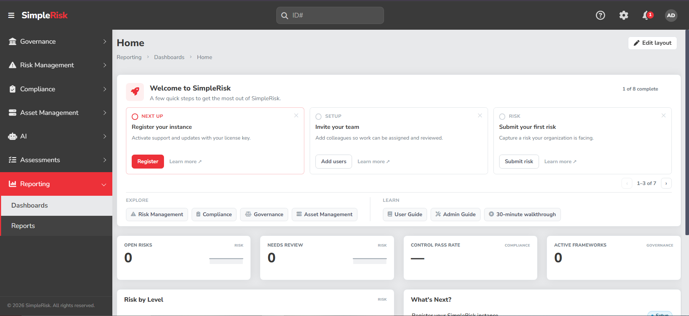
 

### Configuración de roles y usuarios

Se definieron cuatro roles diferenciados aplicando el principio de mínimo privilegio: **Administrador**, **Analista de Riesgos**, **Auditor** y **Propietario de Riesgo**. La separación de funciones garantiza que quien registra un riesgo no sea quien lo revisa formalmente ni quien acepta su mitigación. El detalle completo de permisos, restricciones y usuarios creados se documenta en `configuracion/usuarios.md`.

 
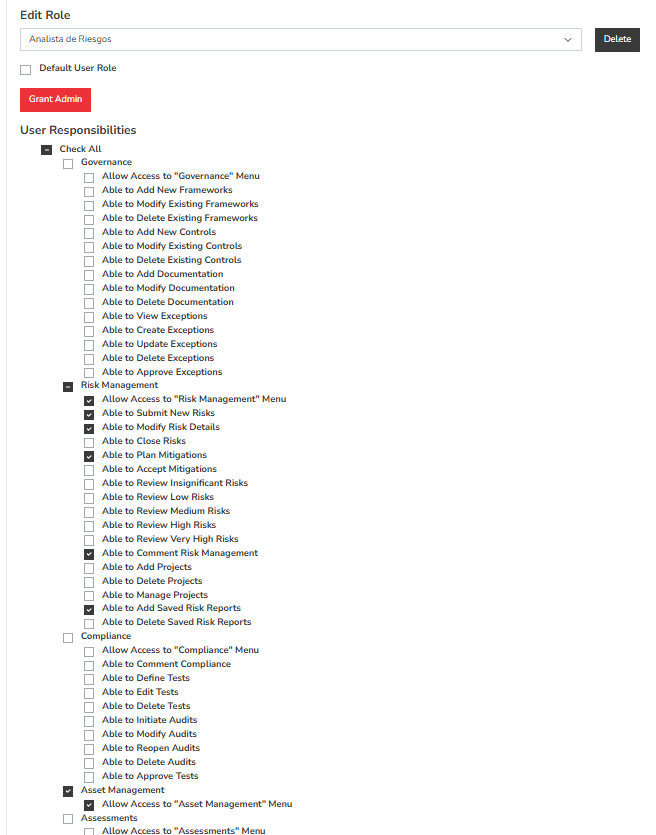
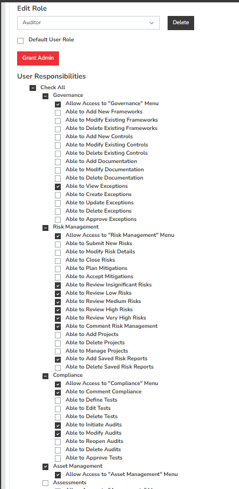
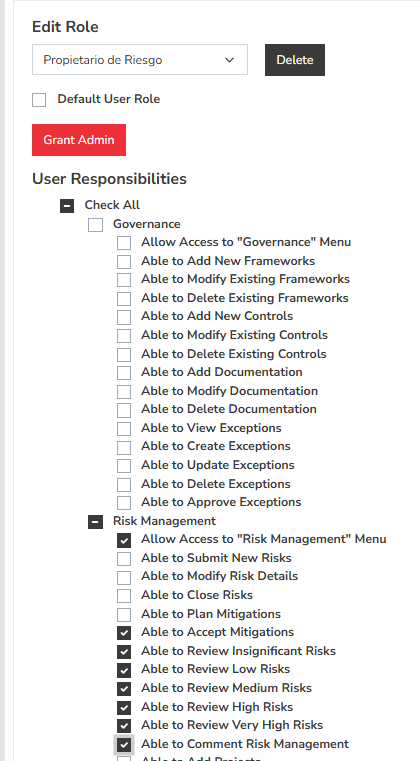
 

### Riesgo de prueba

Se cargó un riesgo de prueba ("Prueba funcional - indisponibilidad del sistema de turnos") utilizando el usuario del rol Analista de Riesgos, validando el flujo completo: autenticación no administrativa, MFA, cambio obligatorio de contraseña, permisos del rol y cálculo automático del nivel de riesgo. El detalle completo está en `configuracion/riesgos.md`.

 
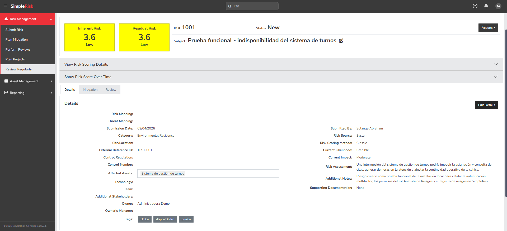
 

---

## Parte B — Escenario Real

### Registro de riesgos de la clínica

Se definieron 10 riesgos específicos del escenario (clínica privada de 120 empleados, 800 pacientes diarios), cubriendo las categorías de confidencialidad, integridad, disponibilidad, legal/normativo y operativo, evitando suponer infraestructura no confirmada por la consigna (equipos médicos, guardia, internación). Cada riesgo incluye descripción, activos afectados, probabilidad e impacto justificados con fuentes (Ley 25.326, Ley 26.529, CISA, HHS, NIST), controles existentes asumidos, tratamiento propuesto y propietario organizacional.

El registro completo, la escala de valoración y la tabla resumen se encuentran en `configuracion/riesgos.md`.

 
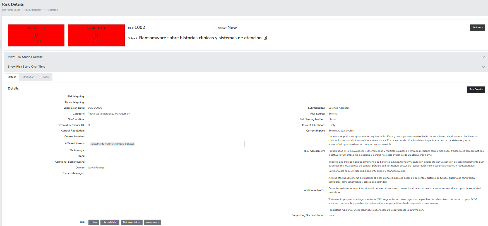
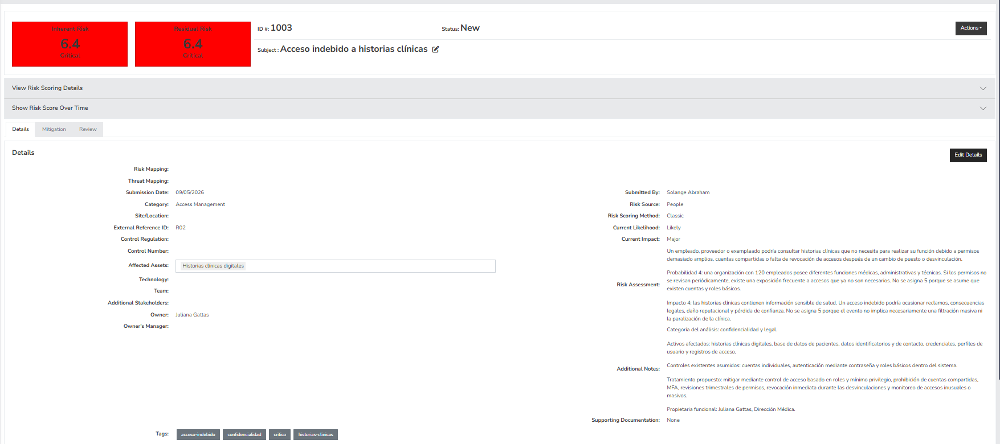
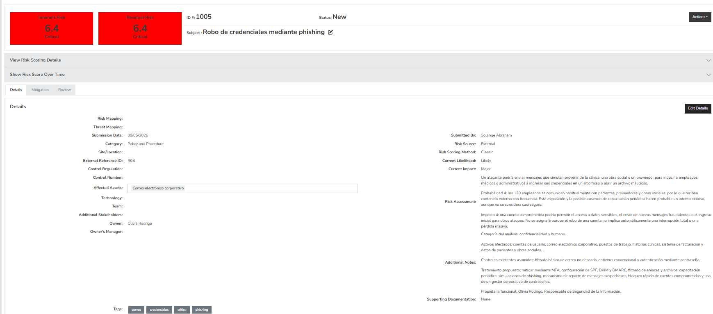
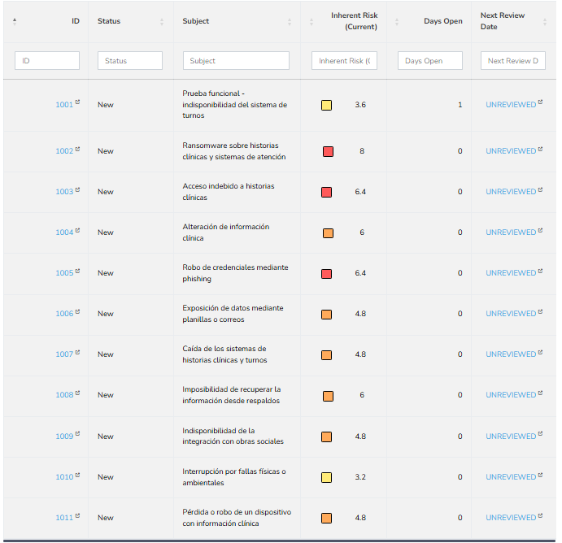
 

### Planes de acción

Se definieron 3 planes de acción asociados a riesgos de nivel **Alto** (no Crítico, para respetar literalmente la categoría de la consigna de la cátedra): PA01 (respaldos 3-2-1, asociado a R07), PA02 (trazabilidad de historias clínicas, asociado a R03) y PA03 (continuidad con obras sociales, asociado a R08). Cada plan tiene responsable, fecha de vencimiento, presupuesto estimado diferenciado y estado inicial `Mitigation Planned` (0%). El detalle completo está en `configuracion/riesgos.md`.

 
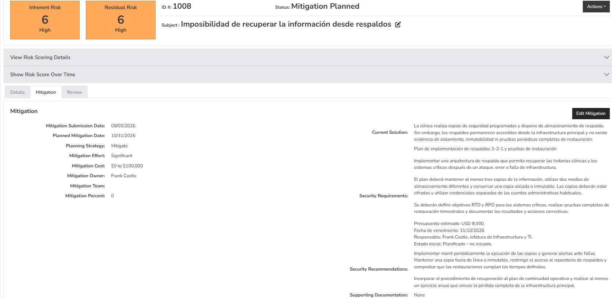
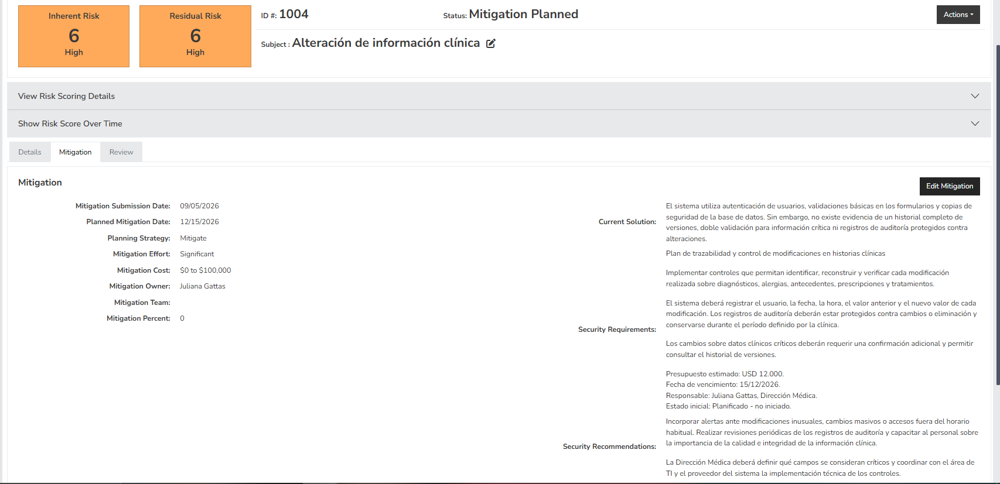
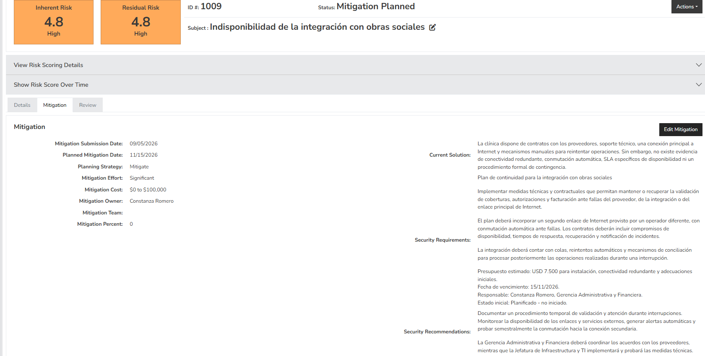
 

### Reporte ejecutivo

Se elaboró un reporte ejecutivo de 3 páginas dirigido al Directorio (`reporte-ejecutivo/reporte_ejecutivo.pdf`), con resumen ejecutivo, Top 5 de riesgos por nivel, estado de los planes de acción y recomendaciones prioritarias.

> **Nota sobre los requerimientos especiales de la consigna:** el enunciado del TP incluía referencias no convencionales para un reporte ejecutivo (analogía de los tres cerditos, del lobo feroz y Caperucita Roja, y de la ubicación del centro de datos respecto de cocinas y piletas). Tras evaluar que ese tipo de contenido no era apropiado para un documento profesional dirigido al Directorio de la clínica, se decidió no incluirlo en la versión final del reporte ejecutivo. 

---
## Parte C — Análisis Crítico y Profundización

### 1. Comparación metodológica: SimpleRisk y FAIR

#### Introducción

Para construir el registro inicial de riesgos de la clínica se utilizó el método clásico de SimpleRisk, basado en la combinación de probabilidad e impacto. Este enfoque permitió identificar, clasificar y priorizar rápidamente los riesgos mediante una matriz de 5 × 5.

Como metodología alternativa se investigó FAIR (Factor Analysis of Information Risk), un modelo cuantitativo orientado a expresar el riesgo en términos de frecuencia y magnitud probable de pérdidas económicas.

La comparación no busca determinar que una metodología sea universalmente superior a la otra. Cada una responde a necesidades diferentes y requiere distintos niveles de información, tiempo y madurez organizacional.

#### Enfoque clásico utilizado en SimpleRisk

En el trabajo se valoró cada riesgo asignando:

- Una probabilidad entre 1 y 5.
- Un impacto entre 1 y 5.
- Un nivel resultante calculado mediante probabilidad × impacto.

Por ejemplo, el riesgo R01, "Ransomware sobre historias clínicas y sistemas de atención", recibió una probabilidad de 4 y un impacto de 5:

`4 × 5 = 20 — Crítico`

SimpleRisk normaliza internamente este resultado en su escala de 0 a 10, por lo que el riesgo se muestra con un valor de 8,0 dentro de la herramienta.

Este método permite comparar rápidamente diferentes riesgos y representarlos mediante niveles y colores. Sin embargo, los valores utilizados son ordinales: indican que una categoría es mayor o menor que otra, pero no poseen una unidad económica o temporal concreta.

Por lo tanto, un resultado de 20 no significa que la clínica perderá veinte unidades monetarias, que el incidente ocurrirá veinte veces ni que será exactamente el doble de grave que un riesgo con valor 10. Su finalidad principal es ordenar prioridades.

#### Metodología FAIR

FAIR, cuyas siglas significan Factor Analysis of Information Risk, es un modelo cuantitativo para analizar riesgos de información y riesgos operativos.

FAIR define el riesgo como la frecuencia probable y la magnitud probable de pérdidas futuras. En lugar de utilizar únicamente categorías como "probable", "alto" o "crítico", busca estimar rangos cuantificables y hacer explícita la incertidumbre existente.

Sus dos componentes principales son:

**Frecuencia de Eventos de Pérdida**

La Loss Event Frequency (LEF) representa la frecuencia con la que se espera que una amenaza produzca una pérdida dentro de un período determinado, normalmente un año.

Para estimarla, FAIR considera, entre otros elementos:

- La frecuencia con la que la organización entra en contacto con una amenaza.
- La frecuencia con la que el actor intenta actuar contra el activo.
- La capacidad del actor de amenaza.
- La resistencia que ofrecen los controles implementados.
- La probabilidad de que la acción produzca efectivamente una pérdida.

Por ejemplo, para analizar un ataque de ransomware no bastaría con asignar "probabilidad 4". Se deberían estimar los intentos de phishing recibidos, la posibilidad de que un empleado interactúe con un mensaje malicioso, la eficacia del filtrado de correo, el uso de MFA y la capacidad del atacante para superar los controles.

**Magnitud de Pérdida**

La Loss Magnitude (LM) representa la magnitud económica probable de las consecuencias si el evento ocurre.

FAIR distingue entre pérdidas primarias, que afectan directamente a la organización, y pérdidas secundarias, que aparecen como consecuencia de la reacción de terceros.

En el escenario de la clínica podrían considerarse:

- Pérdida de productividad durante la interrupción.
- Imposibilidad de acceder a historias clínicas y turnos.
- Interrupción de la facturación.
- Horas de trabajo destinadas a la respuesta al incidente.
- Recuperación o reemplazo de sistemas.
- Servicios técnicos y legales.
- Notificación a personas afectadas.
- Posibles sanciones, reclamos o demandas.
- Daño reputacional y pérdida de confianza.

El resultado de un análisis FAIR no debería ser un único número presentado como exacto. Habitualmente se utilizan rangos y distribuciones que permiten representar diferentes resultados posibles y la incertidumbre de las estimaciones.

#### Comparación entre los enfoques

| Criterio                        | SimpleRisk con matriz clásica            | FAIR                                                      |
| ---                             | ---                                      | ---                                                       |
| Tipo de análisis                | Cualitativo o semicuantitativo           | Cuantitativo                                              |
| Variables principales           | Probabilidad e impacto                   | Frecuencia y magnitud de pérdida                          |
| Resultado                       | Puntaje y nivel de riesgo                | Rango probable de pérdida económica                       |
| Información requerida           | Valoraciones de especialistas y conocimiento general del escenario | Datos históricos, costos, métricas y estimaciones más detalladas |
| Complejidad                     | Baja                                     | Media o alta                                              |
| Tiempo de aplicación            | Reducido                                 | Mayor                                                     |
| Tratamiento de la incertidumbre | Se refleja indirectamente en la elección de valores | Se representa mediante rangos y distribuciones |
| Comunicación                    | Niveles y colores fáciles de interpretar | Valores económicos útiles para decisiones presupuestarias |
| Uso principal                   | Registrar y priorizar una cartera amplia de riesgos | Profundizar escenarios y justificar inversiones |
| Perfil organizacional           | Organizaciones que comienzan a formalizar la gestión de riesgos | Organizaciones con mayor madurez y disponibilidad de información |

#### SimpleRisk: ventajas, desventajas y contexto de uso

**Ventajas:** es sencillo de comprender y aplicar; permite registrar una gran cantidad de riesgos en poco tiempo; no necesita información financiera o histórica detallada; facilita la comunicación mediante colores y niveles fáciles de interpretar; y se integra directamente con el registro, los propietarios, las revisiones y los planes de mitigación dentro de la misma herramienta.

**Desventajas:** la asignación de probabilidad e impacto depende del criterio del evaluador, por lo que distintas personas podrían valorar el mismo escenario de forma diferente; los puntajes son ordinales, no económicos (un resultado de 20 indica prioridad, pero no cuánto podría perder la clínica ni permite compararlo con el costo de un control); y dos riesgos pueden obtener el mismo resultado mediante combinaciones distintas de probabilidad e impacto, lo que puede ocultar diferencias reales entre amenazas y consecuencias.

**Contexto de uso:** este enfoque resulta apropiado cuando se necesita construir rápidamente un registro inicial con muchos riesgos por ordenar, la organización no dispone de datos históricos suficientes y se busca una comunicación visual sencilla — exactamente la situación de la clínica ficticia, que tras la auditoría externa necesitaba un primer registro ágil.

#### FAIR: ventajas, desventajas y contexto de uso

**Ventajas:** expresa el riesgo en términos comprensibles para la dirección financiera; descompone el escenario en factores específicos (frecuencia y magnitud) que pueden analizarse por separado; hace explícita la incertidumbre de las estimaciones mediante rangos en vez de un número único; y permite comparar la pérdida probable con el costo de los controles, ayudando a priorizar inversiones según la reducción económica esperada.

**Desventajas:** requiere más tiempo, conocimiento especializado y datos históricos, técnicos y económicos que no siempre están disponibles; su calidad depende directamente de la calidad de esos datos, y si se asignan valores monetarios sin evidencia suficiente puede producirse una falsa precisión; y puede resultar excesivo aplicarlo a la totalidad de los riesgos de una organización con baja madurez, en lugar de reservarlo para casos puntuales.

**Contexto de uso:** FAIR es más apropiado cuando deben evaluarse en profundidad riesgos específicos, se necesita justificar una inversión concreta ante el Directorio, existen datos confiables sobre incidentes y costos, o las consecuencias económicas y regulatorias son especialmente relevantes — situaciones de mayor madurez que las que tiene hoy la clínica del escenario.

#### Aplicación conceptual al riesgo R01

Para mostrar la diferencia entre ambos enfoques se toma como ejemplo el riesgo R01, "Ransomware sobre historias clínicas y sistemas de atención".

**Evaluación mediante SimpleRisk:** probabilidad 4, impacto 5, resultado 20 (Crítico), valor normalizado 8,0. Esta valoración permite determinar rápidamente que R01 debe recibir atención inmediata.

**Evaluación mediante FAIR:** el escenario debería definirse con mayor precisión, por ejemplo:

> Un grupo de ciberdelincuentes obtiene acceso a la red de la clínica mediante credenciales comprometidas por phishing, cifra los sistemas de historias clínicas, turnos y facturación, y provoca una interrupción operativa y costos de recuperación.

Para estimar la frecuencia del evento de pérdida se necesitarían datos como la cantidad anual de intentos de phishing recibidos, el porcentaje de mensajes que supera los filtros, la frecuencia con la que los usuarios interactúan con mensajes maliciosos, la cobertura real de MFA, la cantidad de endpoints vulnerables y la eficacia del antivirus, EDR y segmentación de red.

Para estimar la magnitud de la pérdida se necesitaría conocer la facturación promedio por hora o por día, el costo de una hora de interrupción, el tiempo probable de recuperación, la cantidad de empleados afectados, el costo de especialistas externos y de restauración de sistemas, los gastos legales y de notificación, y las posibles sanciones o consecuencias reputacionales.

Con esta información podrían construirse rangos de frecuencia y pérdida, y compararse la exposición económica con el costo de los controles propuestos. En este trabajo no se calcula una pérdida anual para R01 porque el escenario no proporciona los datos históricos y económicos necesarios; asignar valores monetarios sin evidencia introduciría una precisión aparente que no podría justificarse.

#### Conclusión

Para la situación actual de la clínica, el enfoque clásico de SimpleRisk resulta adecuado para construir el registro inicial y establecer prioridades: permitió identificar diez riesgos, distinguir niveles críticos, altos y medios, y asociar propietarios y planes de mitigación. FAIR no reemplazaría este registro, sino que podría aplicarse selectivamente como segunda etapa sobre los riesgos más relevantes (ransomware, indisponibilidad de sistemas, exposición de datos sensibles) para justificar inversiones concretas, a medida que la clínica genere información histórica y mejore su madurez en gestión de riesgos.

### 2. Integración con herramientas externas

#### Arquitectura de la integración

Se implementó un flujo de automatización con **n8n**, ejecutado como contenedor adicional en el mismo `docker-compose.yml` y expuesto únicamente en `127.0.0.1:5678`.

La instalación de SimpleRisk utilizada no tenía habilitada su API REST. Por ese motivo, la integración se realizó mediante consulta directa a la base de datos MySQL que SimpleRisk utiliza internamente, con un usuario dedicado (`n8n_reader`) que posee únicamente permisos `SELECT` sobre la base `simplerisk` — aplicando el mismo principio de mínimo privilegio que se usó para el resto de los usuarios y roles del TP.

El flujo realiza lo siguiente:

1. Consulta la base de datos cada 15 minutos (patrón de *polling*, ya que no se recibe un evento emitido directamente por SimpleRisk, sino que n8n consulta el origen periódicamente).
2. La consulta selecciona los riesgos con puntuación normalizada igual o superior a 4,0 (equivalente a los niveles Alto y Crítico de la matriz de la cátedra) que no se encuentren en estado cerrado.
3. Un nodo de deduplicación (`Remove Duplicates`) compara, en cada ejecución, la combinación de identificador del riesgo, puntuación y estado contra lo procesado en ejecuciones anteriores.
4. Si el riesgo es nuevo, o si cambió su puntuación o su estado desde la última ejecución, se dispara la notificación; si no hubo cambios, no se genera ninguna acción.
5. Cuando corresponde notificar, el flujo envía una alerta a un canal privado de **Discord** (mediante webhook) y crea un **Issue** en un repositorio de GitHub dedicado al seguimiento (`clinica-riesgos-seguimiento`, independiente del repositorio compartido de la cátedra), con el detalle del riesgo, su nivel y una etiqueta según severidad (`critical` o `high`).

 
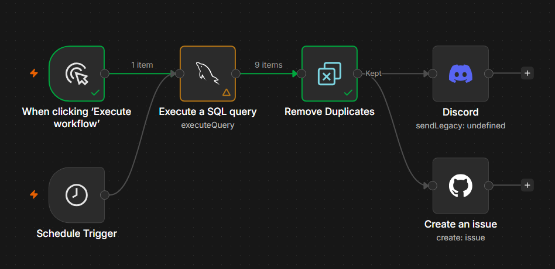
 

#### Justificación de las herramientas y decisiones de diseño

- **Polling sobre la base de datos en lugar de un webhook saliente de SimpleRisk**: se adoptó porque la API de SimpleRisk no estaba disponible en esta instalación. Se documenta como limitación conocida más abajo.
- **Usuario de solo lectura (`n8n_reader`)**: garantiza que la integración nunca modifique el estado de SimpleRisk, solo lo consulte.
- **Discord** se eligió para notificación inmediata, de bajo costo de configuración, apta para un equipo pequeño de seguridad.
- **GitHub Issues**, en un repositorio propio y separado del repositorio de la entrega, da trazabilidad y seguimiento formal a cada riesgo detectado sin introducir ruido en el repositorio compartido de la cátedra — de forma análoga a como un hallazgo de auditoría genera un ítem de seguimiento.
- **Deduplicación por ID + puntuación + estado**: evita saturar el canal de Discord y el tablero de Issues con alertas repetidas de riesgos que no cambiaron entre una ejecución y la siguiente.
- **Intervalo de 15 minutos**: automatiza la detección sin generar una carga de consultas excesiva sobre la base de datos.

#### Configuración y seguridad

Las credenciales de la base de datos (`n8n_reader`), el webhook de Discord y el token de acceso de GitHub se cargan manualmente dentro del panel de credenciales de n8n — no viajan en el `docker-compose.yml` ni en el workflow exportado — y quedan cifradas en el volumen `n8n_data` mediante la variable `N8N_ENCRYPTION_KEY`, definida en `.env`. El token de GitHub utilizado tiene alcance limitado, autorizado únicamente sobre el repositorio de seguimiento y con permisos mínimos (lectura de metadata, lectura/escritura de Issues). Este esquema es consistente con el resto del manejo de secretos del TP (credenciales de MySQL de SimpleRisk y de su cuenta administradora, también excluidas del repositorio).

#### Evidencia de funcionamiento

 
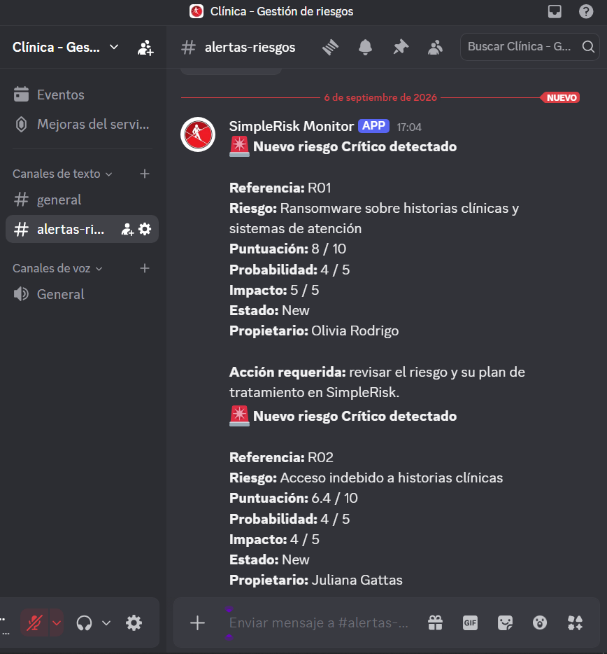
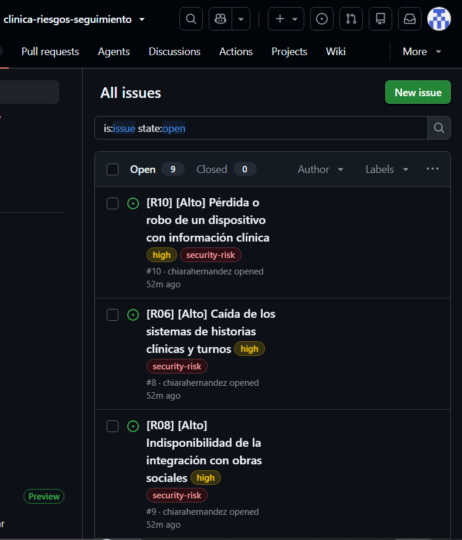
 

#### Limitaciones conocidas

- La integración es unidireccional: n8n lee información de SimpleRisk pero no la modifica.
- La consulta depende de la estructura interna de la base de datos de SimpleRisk; un cambio futuro en el esquema de tablas podría requerir actualizar la consulta.
- Se detectan riesgos nuevos y cambios en la puntuación o el estado, pero un cambio que afecte únicamente la descripción o el propietario no genera una nueva alerta, porque esos campos no forman parte de la clave de deduplicación.
- Cuando un riesgo se cierra en SimpleRisk, deja de aparecer en la consulta y de notificarse, pero el Issue de GitHub ya creado no se cierra automáticamente.
- Las credenciales deben configurarse nuevamente si el workflow se importa en otra instalación.

---

## Parte D — Actividad Optativa

### D2 — Integración real implementada

Se optó por la actividad D2 (implementar una integración real mediante webhook/automatización que notifique riesgos de nivel alto). La implementación completa, con arquitectura, configuración, decisiones de diseño y evidencia de funcionamiento, se documenta en la sección "Integración con herramientas externas" de la Parte C de este informe — la misma pieza de trabajo cubre ambos requerimientos.

La definición declarativa del flujo de n8n se encuentra disponible para su auditoría en `scripts/workflow_alertas_riesgos.json`.

---

## Fuentes de referencia

* [Ley 25.326 de Protección de los Datos Personales](https://www.argentina.gob.ar/normativa/nacional/ley-25326-64790/actualizacion).
* [Ley 26.529 de Derechos del Paciente e Historia Clínica](https://www.argentina.gob.ar/normativa/nacional/norma-160432/actualizacion).
* [HHS — Healthcare and Public Health Cybersecurity](https://aspr.hhs.gov/readiness-response/response-operations/healthcare-public-health-cybersecurity).
* [CISA — StopRansomware Guide](https://www.cisa.gov/stopransomware/ransomware-guide).
* [NIST SP 800-53 Rev. 5](https://csrc.nist.gov/pubs/sp/800/53/r5/upd1/final).
* The Open Group. Open FAIR Risk Analysis. https://www.opengroup.org/forum/security/riskanalysis
* The Open Group. Open FAIR Risk Taxonomy Standard. https://pubs.opengroup.org/onlinepubs/9699919899/toc.pdf
* FAIR Institute. What is FAIR? https://www.fairinstitute.org/what-is-fair
* FAIR Institute. FAIR Terminology 101: Risk, Threat Event Frequency and Vulnerability. https://www.fairinstitute.org/blog/fair-terminology-101-risk-threat-event-frequency-and-vulnerability
* FAIR Institute. FAIR Risk Basics: What Is Loss Magnitude? https://www.fairinstitute.org/blog/fair-risk-basics-what-is-loss-magnitude
* SimpleRisk. Risk Submission and Classic Risk Rating. https://support.simplerisk.com/kb/risk-submission