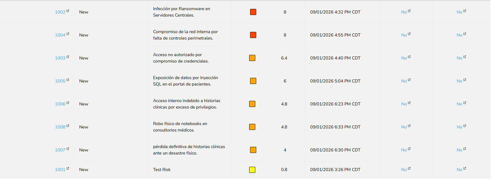
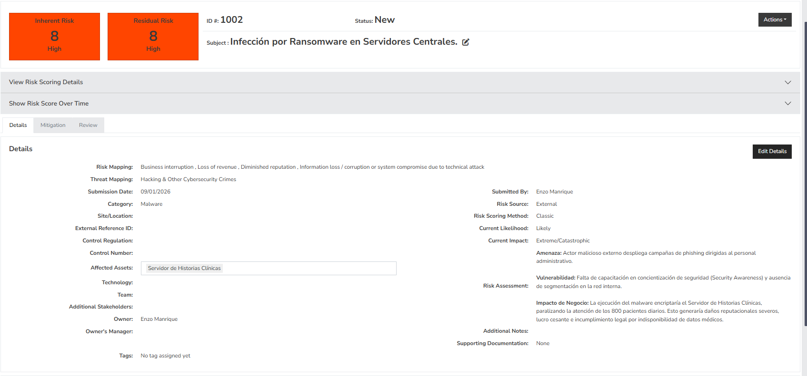
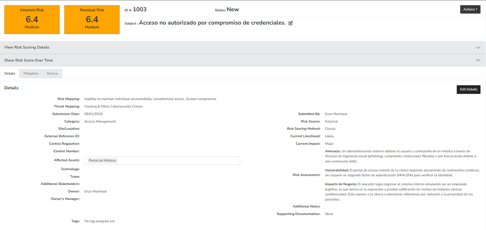
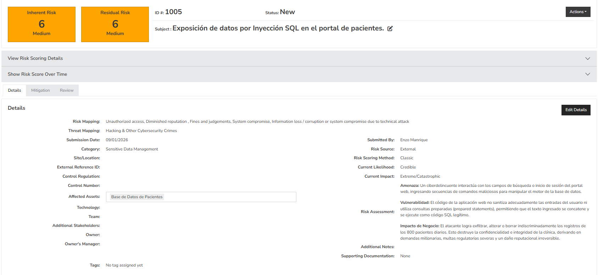
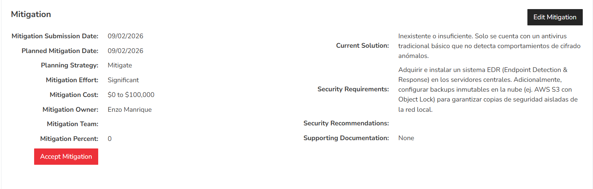
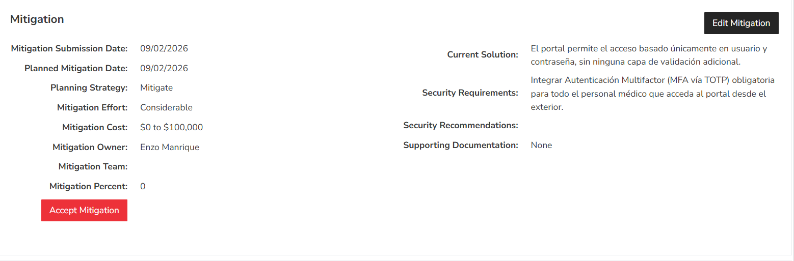
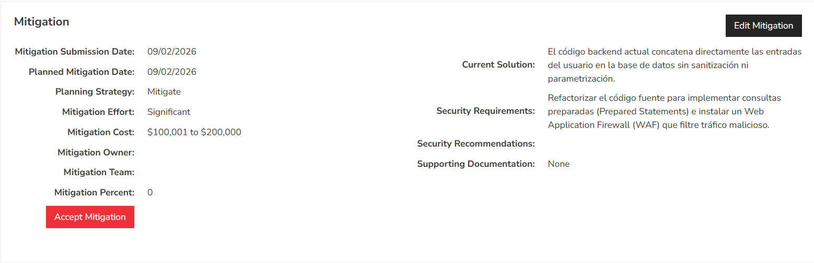
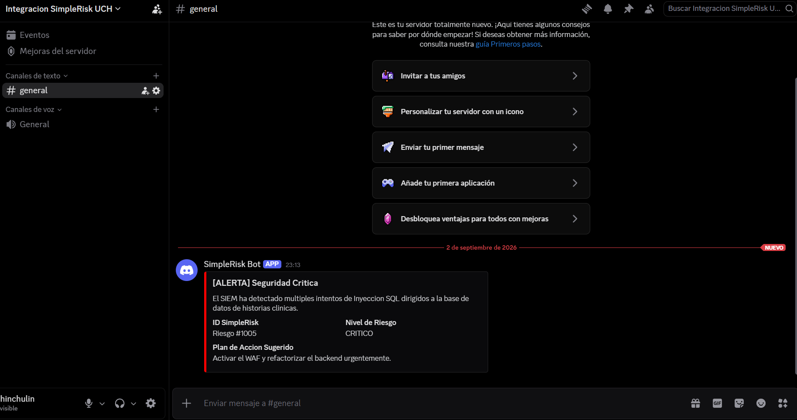

# Informe del Trabajo Práctico: SimpleRisk

## Parte B - Ejecución del Escenario Real

A continuación, se adjunta la evidencia de los riesgos y planes de acción cargados en el sistema SimpleRisk.

### Capturas de Riesgos y Planes de Acción

* 
* 
* 
* 
* 
* 
* 

Las imágenes adjuntas evidencian la carga exitosa y el modelado de los 7 riesgos operativos dentro de la plataforma SimpleRisk. Se documenta la matriz de evaluación (probabilidad e impacto) y el registro formal de los planes de tratamiento técnico asignados a las vulnerabilidades de nivel Alto y Crítico, confirmando el uso integral del ciclo GRC.>

-----------------------------------------------

## Parte C - Análisis Crítico


### 1. Comparación Metodológica

Para este análisis, se contrasta la matriz clásica de probabilidad por impacto utilizada en SimpleRisk frente a la metodología propuesta por la norma **ISO/IEC 27005**.

**Naturaleza y Similitudes de Base**
Aunque ambos enfoques comparten la lógica fundamental de que el riesgo es una función de la probabilidad y el impacto, su naturaleza es distinta. ISO 27005 es una norma internacional que provee un marco de trabajo ("framework de proceso") completo para la gestión de riesgos de seguridad de la información, pensado para complementar a la ISO 27001. Por su parte, SimpleRisk funciona como una "herramienta de ejecución" de software que puede configurarse para seguir estos principios. Mientras SimpleRisk utiliza una matriz fija con valores predefinidos y se orienta al registro de riesgos ya identificados, la ISO 27005 abarca el ciclo completo: desde el establecimiento del contexto hasta el monitoreo, exigiendo modelar explícitamente activos, amenazas y vulnerabilidades, y permitiendo enfoques cualitativos, semicuantitativos o cuantitativos.

**Ventajas y Desventajas de SimpleRisk**
* **Ventajas:** Es una herramienta rápida de implementar y usar, lo cual resulta ideal para equipos pequeños o sin experiencia formal en gestión de riesgos. Su enfoque visual e intuitivo, mediante una matriz de colores, facilita enormemente la comunicación de los riesgos a perfiles no técnicos. Además, posee un bajo costo de entrada por ser una herramienta de código abierto.
* **Desventajas:** Al apoyarse en una matriz simplificada, se puede perder granularidad, provocando que dos riesgos muy distintos caigan en la misma celda y reciban el mismo tratamiento de forma errónea. No obliga a realizar un análisis profundo de activos, amenazas y vulnerabilidades como lo exige la norma, y su dependencia de escalas cualitativas subjetivas puede generar inconsistencias entre distintos evaluadores.

**Ventajas y Desventajas de ISO 27005**
* **Ventajas:** Ofrece un proceso robusto, sistemático y repetible que garantiza la trazabilidad completa del riesgo. Cuenta con amplio reconocimiento internacional, siendo clave si la organización busca certificarse en ISO 27001, y es altamente adaptable a distintos niveles de madurez (permitiendo iniciar de forma cualitativa y evolucionar a métodos cuantitativos).
* **Desventajas:** Su implementación exige una mayor inversión de tiempo, recursos y conocimiento especializado. Puede resultar un marco excesivo para organizaciones pequeñas con necesidades simples, y al no ser una herramienta de software en sí misma, requiere procesos o aplicaciones adicionales (como SimpleRisk) para su ejecución práctica.

**Contexto de Aplicación Ideal**
* **Contexto para SimpleRisk:** Es la opción más conveniente para PyMEs, equipos de TI reducidos o escenarios donde se requiere una primera aproximación ágil a la gestión de riesgos sin incurrir en grandes inversiones en procesos formales.
* **Contexto para ISO 27005:** Es el estándar adecuado para organizaciones medianas o grandes, especialmente aquellas que operan en sectores regulados, que buscan (o ya poseen) un SGSI certificado, y que necesitan justificar sólidamente sus decisiones de riesgo ante auditores, clientes y entes reguladores.
* **Conclusión de Integración:** Cabe destacar que no son mutuamente excluyentes. SimpleRisk puede utilizarse perfectamente como la herramienta que operacionaliza y lleva a la práctica un proceso de gestión de riesgos diseñado bajo los lineamientos de la ISO 27005.


### 2. Integración con Herramientas Externas

Para elevar el nivel de madurez en la ciberseguridad de la clínica, SimpleRisk puede integrarse con un **SIEM (Security Information and Event Management)**, como Wazuh, Splunk o Elastic Security, utilizando la **API RESTful** de SimpleRisk. Esta integración permite automatizar la creación y actualización de riesgos basándose en las amenazas reales detectadas en la red perimetral o en los servidores.

**Pasos teóricos de implementación:**

1. **Detección en el SIEM (Origen):**
   * Se configura una regla de correlación en el SIEM para detectar eventos críticos (ej. el WAF detecta múltiples intentos de Inyección SQL en el portal web de médicos).
   * Se asocia una acción automática (Active Response o Webhook saliente) a esta alerta.

2. **Autenticación y Configuración en SimpleRisk:**
   * Se genera un Token de API (API Key) desde el panel de administración de SimpleRisk para autorizar transacciones de forma segura.
   * Se identifica el endpoint correspondiente para la creación de riesgos (ej. `POST https://[ip-simplerisk]/api/risks`).

3. **Ejecución vía API RESTful:**
   * La acción automática del SIEM dispara una petición HTTP POST hacia el servidor de SimpleRisk.
   * La petición incluye la cabecera de autorización (`Authorization: Bearer [token]`) y un cuerpo en formato JSON que mapea los datos del incidente hacia los campos de SimpleRisk.

**Estructura del Payload (JSON):**
El SIEM envía un objeto JSON estructurado para poblar la base de datos de SimpleRisk automáticamente. Un ejemplo de la petición sería:

```json
{
  "subject": "Alerta SIEM: Intento de Inyección SQL Bloqueado",
  "details": "Múltiples payloads maliciosos detectados dirigidos a la base de datos de historias clínicas desde la IP 203.0.113.45.",
  "category": "Confidencialidad",
  "scoring": {
    "likelihood": 5,
    "impact": 5
  },
  "owner": "Equipo de Respuesta a Incidentes"
}
```

**Ejemplo de webhook enviado a discord**

* 

-----------------------------------------------

## Parte D - Actividades Optativas

**Optativa D2 Completada:** Se implementó exitosamente una integración real mediante un Webhook hacia un servidor de Discord. El script utilizado (`scripts/alerta_webhook.ps1` / `.py`) permite que ante una alerta crítica del SIEM, se notifique automáticamente al equipo en un canal de chat seguro. La evidencia de esta integración se adjuntó en la sección anterior.