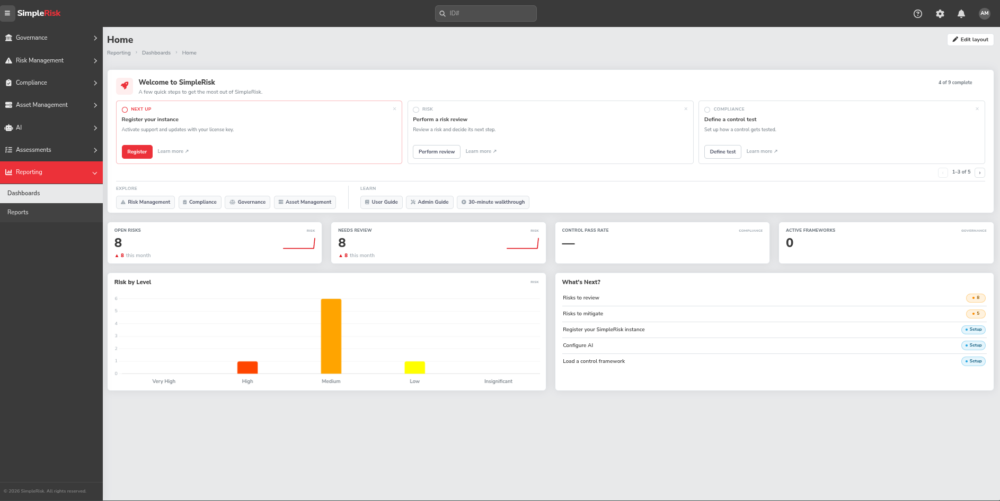
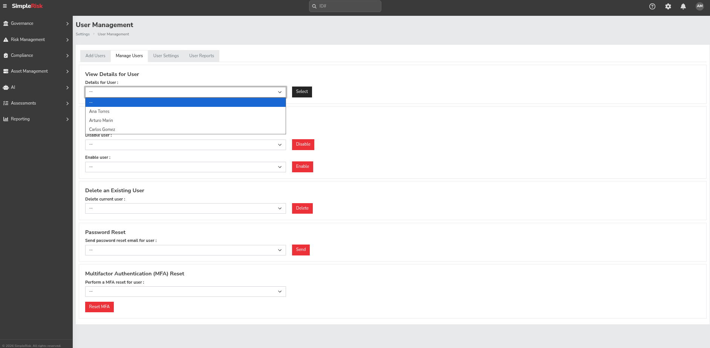
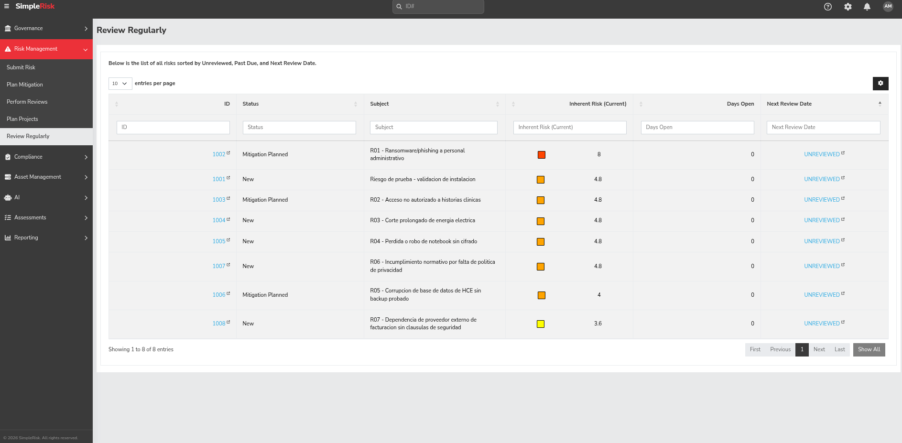
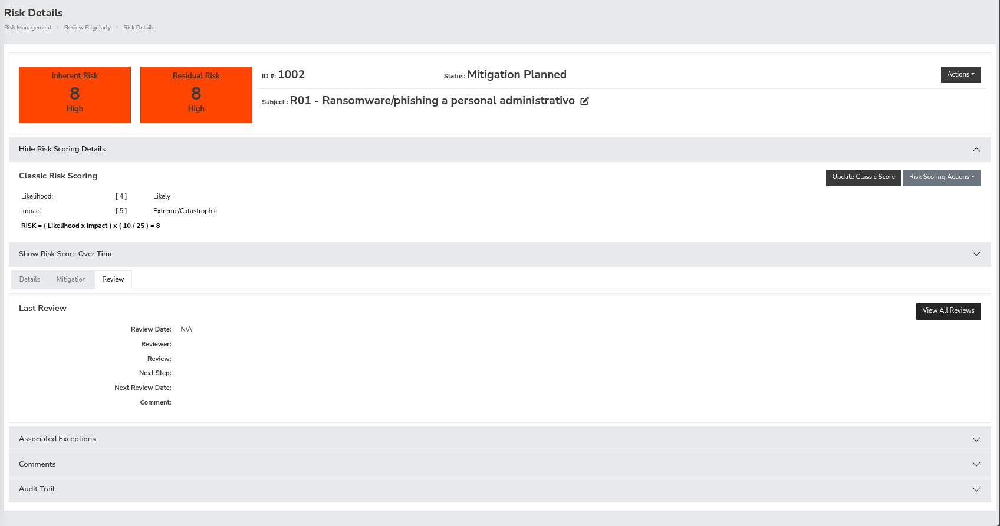
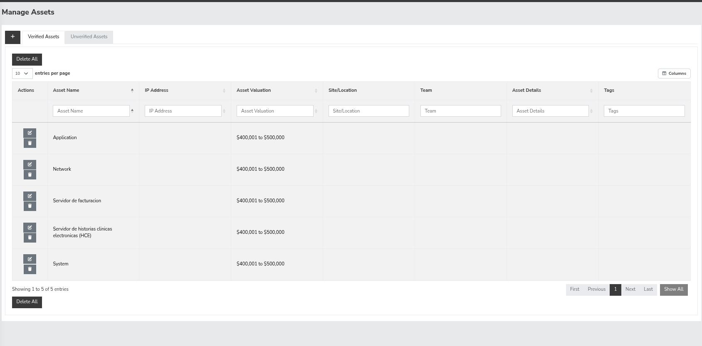
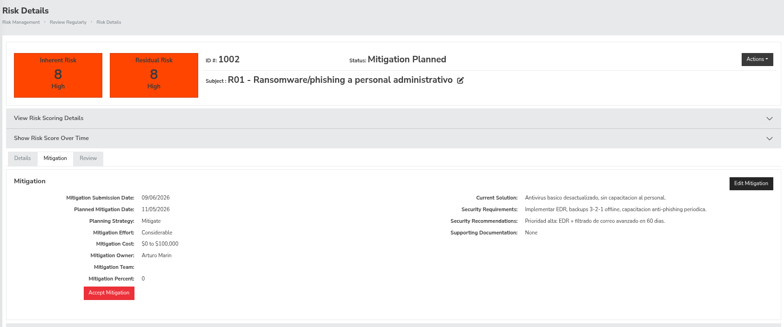
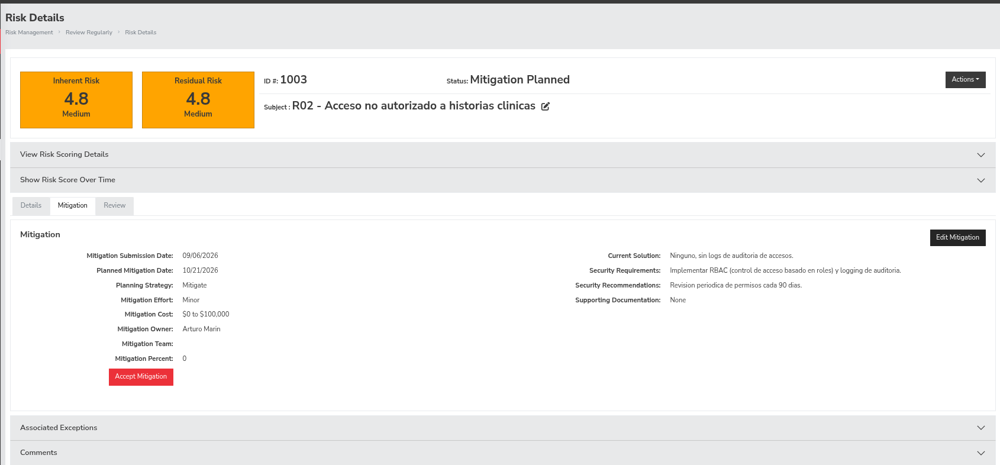
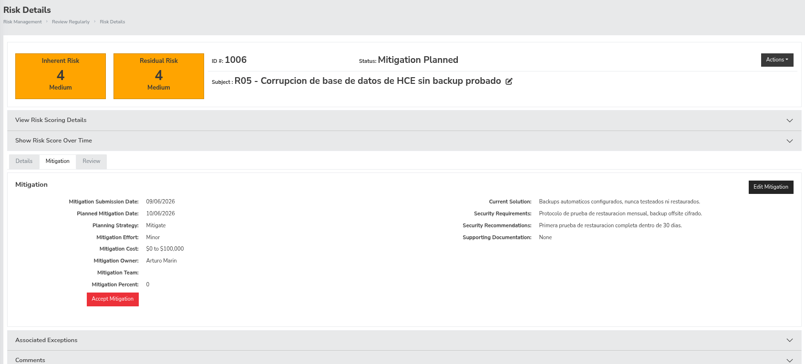

# Informe — TP Gestión de Riesgos con SimpleRisk

**Alumno:** Arturo Marín — LU 31317029
**Materia:** Seguridad de Sistemas

## 1. Introducción

Este informe documenta la instalación, configuración y uso de SimpleRisk para gestionar el registro inicial de riesgos de una clínica privada ficticia (120 empleados, ~800 pacientes/día, historias clínicas digitales, datos de obra social y facturación), según el escenario propuesto en la consigna del TP.

## 2. Parte A — Instalación y Configuración Básica

### 2.1 Instalación

Se desplegó SimpleRisk mediante Docker Compose, usando el stack oficial (`simplerisk/simplerisk-minimal` + `mysql:8.0` + `namshi/smtp`), definido en [`entorno/docker-compose.yml`](../entorno/docker-compose.yml).

```bash
cd entorno/
docker compose up -d
```

**Problemas encontrados y solución (documentado para reproducibilidad):**

- El entorno usa **Podman** (con alias `docker`), que en modo rootless no resuelve nombres de imagen cortos ni permite bindear puertos privilegiados (<1024). Se solucionó usando nombres de imagen completos (`docker.io/...`) y publicando en puertos `8080`/`8443` en lugar de `80`/`443`.
- SimpleRisk fuerza una redirección interna a `https://localhost/` (puerto 443 implícito) tras el primer acceso por HTTP. Al no tener el 443 mapeado, se accede directamente por `https://localhost:8443` para evitar el conflicto.

Acceso: `https://localhost:8443` (certificado autofirmado, se acepta el warning del navegador).



### 2.2 Usuarios y Permisos

Se crearon 3 usuarios con roles diferenciados según principio de mínimo privilegio. El detalle completo está en [`../configuracion/usuarios.md`](../configuracion/usuarios.md).

| Usuario | Rol | Resumen de permisos |
|---|---|---|
| `admin_demo` | Administrador | Acceso total |
| `analista_riesgos` | Analista de Riesgos | Alta y gestión de riesgos, sin cierre/aprobación |
| `auditor_demo` | Auditor | Revisión y aprobación, sin creación/edición |

Nota técnica: en esta versión de SimpleRisk, el campo "Role" del formulario de alta de usuario solo distingue Administrator de usuario común (`--`). La diferenciación real de rol se logra vía el checklist granular de "User Responsibilities".



### 2.3 Riesgo de Prueba

Se cargó un riesgo de validación (ID 1001, "Riesgo de prueba - validación de instalación") para confirmar el funcionamiento end-to-end de la plataforma tras el despliegue (visible como primer registro en la captura de la sección 3.1).

## 3. Parte B — Escenario Real: Clínica Privada

### 3.1 Registro de Riesgos

Se identificaron y cargaron 7 riesgos específicos del contexto de la clínica, cubriendo las categorías de confidencialidad, integridad, disponibilidad, legal y operativo. El detalle completo (activos, controles, tratamiento, propietario, justificación de probabilidad/impacto con fuentes) está en [`../configuracion/riesgos.md`](../configuracion/riesgos.md).

Resumen:

| ID | Riesgo | Prob. | Impacto | Nivel (matriz manual) | Nivel (SimpleRisk) |
|---|---|---|---|---|---|
| R01 | Ransomware/phishing | 4 | 5 | Crítico | Alto (8) |
| R02 | Acceso no autorizado a HCE | 3 | 4 | Alto | Medio (4.8) |
| R03 | Corte prolongado de energía | 3 | 4 | Alto | Medio (4.8) |
| R04 | Pérdida/robo de notebook sin cifrado | 3 | 4 | Alto | Medio (4.8) |
| R05 | Corrupción de BD sin backup probado | 2 | 5 | Alto | Medio (4) |
| R06 | Incumplimiento normativo | 4 | 3 | Alto | Medio (4.8) |
| R07 | Dependencia de proveedor externo | 3 | 3 | Medio | Bajo (3.6) |

**Observación importante:** el nivel calculado por SimpleRisk (método "Clásico") es sistemáticamente más bajo que el de la matriz manual de la cátedra. Esto se debe a que SimpleRisk aplica `Riesgo = (Probabilidad × Impacto) × (10/25)`, comprimiendo la escala 1-25 a un rango 0-10, mientras que la matriz de la cátedra clasifica directamente sobre 1-25. Es una diferencia puramente de escala/umbral, no de criterio — ambos parten de los mismos valores de Probabilidad e Impacto. Se profundiza en la Parte C.




**Problema encontrado y solución:** al crear un asset nuevo directamente desde el formulario de carga de riesgo, SimpleRisk lo deja en estado "Unverified" y no lo asocia automáticamente al riesgo. Fue necesario ir a **Asset Management → Unverified Assets → Verify All** para aprobarlos antes de poder vincularlos correctamente.



### 3.2 Planes de Acción

Se definieron 3 planes de mitigación para los riesgos de mayor severidad según la matriz manual (R01, R02, R05):

| Riesgo | Estrategia | Responsable | Presupuesto | Vencimiento | Estado |
|---|---|---|---|---|---|
| R01 — Ransomware | Mitigar (EDR + backups 3-2-1 + capacitación) | admin_demo | USD 3000 | 05/11/2026 | Planificado |
| R02 — Acceso no autorizado | Mitigar (RBAC + logging) | admin_demo | USD 800 | 21/10/2026 | Planificado |
| R05 — Backup sin probar | Mitigar (prueba de restauración mensual) | admin_demo | USD 500 | 06/10/2026 | Planificado |





### 3.3 Reporte Ejecutivo

Ver [`../reporte-ejecutivo/reporte.pdf`](../reporte-ejecutivo/reporte.pdf).

## 4. Parte C — Análisis Crítico y Profundización

### 4.1 Comparación metodológica: SimpleRisk (matriz clásica) vs. FAIR

**SimpleRisk (método Clásico)** evalúa riesgos con escalas ordinales cualitativas de 1 a 5 para Probabilidad e Impacto, asignadas por juicio experto, y calcula `Riesgo = Probabilidad × Impacto` (normalizado internamente a un rango 0-10 mediante el factor `×10/25`, como se documentó en la sección 3.1).

**FAIR (Factor Analysis of Information Risk)** es un modelo cuantitativo: descompone el riesgo en Frecuencia de Eventos de Pérdida (LEF) y Magnitud Probable de Pérdida (PLM), estimadas como rangos (mínimo/más probable/máximo) y combinadas mediante simulación probabilística (Monte Carlo). El resultado no es un color en una matriz, sino una distribución de pérdida económica esperada (ej.: "10% de probabilidad anual de una pérdida entre USD 50.000 y USD 500.000").

**Ventajas del enfoque de SimpleRisk frente a FAIR:**

- Rapidez de implementación: no requiere datos históricos de pérdidas ni expertise actuarial, algo que la clínica —recién iniciando su programa de riesgos tras la auditoría— no tiene.
- Comunicación visual simple (matriz de colores), fácil de interpretar para un directorio no técnico.
- Bajo costo de entrada, apropiado para organizaciones sin equipo de riesgo dedicado.

**Desventajas del enfoque de SimpleRisk frente a FAIR:**

- Subjetividad: la asignación de "Probable" vs. "Casi seguro" depende del criterio de quien carga el riesgo, no de un cálculo verificable.
- No permite justificar inversiones en términos de retorno (no se puede responder "¿vale USD 3.000 en EDR?" con una cifra financiera comparable).
- Hallazgo propio durante este TP: SimpleRisk normaliza el score con `(P×I)×(10/25)`, lo que comprime artificialmente los niveles. Nuestro R01, Crítico (20/25) según la matriz de la cátedra, aparece como "Alto" (8/10) dentro de la herramienta. Esta falta de transparencia en el cálculo interno es en sí misma una limitación metodológica: dificulta la trazabilidad y la comparación entre organizaciones que usan criterios distintos.

**Ventajas de FAIR frente a SimpleRisk:**

- Cuantifica el riesgo en pérdida esperada (USD), permitiendo comparar riesgos de naturaleza distinta (ransomware vs. incumplimiento normativo) en una misma unidad.
- Habilita análisis costo-beneficio de controles y decisiones de transferencia (seguros cibernéticos).
- Es el estándar de facto para reportar riesgo ante juntas directivas y aseguradoras en organizaciones maduras.

**Desventajas de FAIR:**

- Requiere datos de frecuencia/magnitud de pérdida que rara vez existen en organizaciones pequeñas, o estimaciones expertas con incertidumbre igual de alta que la matriz cualitativa.
- Mayor curva de aprendizaje y tiempo de implementación.
- No viene integrado en SimpleRisk; requeriría una herramienta adicional (ej. FAIR-U / RiskLens).

**¿En qué contexto conviene cada una?**

- **SimpleRisk / matriz clásica** es adecuado para el estado actual de la clínica: primer registro de riesgos, sin equipo de riesgo dedicado, presupuesto de tratamiento acotado, y urgencia de visibilidad rápida tras la observación de la auditoría. Es exactamente el escenario de este TP.
- **FAIR** es recomendable en una segunda etapa de madurez: cuando la organización tenga historial propio o sectorial de incidentes, necesite justificar presupuesto de seguridad con cifras concretas ante el directorio, o quiera contratar un seguro cibernético (las aseguradoras piden estimaciones cuantitativas de pérdida).

### 4.2 Integración con herramienta externa

Se investigó cómo integrar SimpleRisk con **Slack**, para notificar automáticamente la creación de riesgos críticos al equipo de seguridad.

**Investigación técnica realizada:** se inspeccionó el propio contenedor de SimpleRisk (`docker exec` sobre `/var/www/simplerisk/api`) buscando un canal de integración programático:

- Existe un **servidor MCP nativo** (`/api/mcp`) pensado para agentes de IA, pero es de **solo lectura** (tools como `get_context`, `list_highest_risks`) — no expone ninguna operación de escritura para riesgos.
- Existe un **REST API v2** con endpoint para crear riesgos, pero su autenticación depende del **"API Extra"**, un addon **comercial** de SimpleRisk. Se confirmó que el directorio `extras/api/` no está presente en la imagen gratuita (`simplerisk-minimal`) usada en este TP — sin licencia paga, el endpoint es inalcanzable.

**Diseño de integración propuesto (sin costo, viable con SimpleRisk Core):**

SimpleRisk Core sí soporta notificaciones nativas por correo (Admin → Email Settings), y el stack de este TP ya despliega un contenedor SMTP dedicado (`namshi/smtp`, ver [`entorno/docker-compose.yml`](../entorno/docker-compose.yml)). Slack, por su parte, permite asignar una dirección de email única a cualquier canal ("Email to Slack channel"). Combinando ambos:

1. Configurar en SimpleRisk el servidor SMTP saliente (apuntando a un relay real con salida a internet, ej. SendGrid).
2. Crear en Slack un canal `#riesgos-criticos` y habilitar su dirección de email dedicada.
3. Configurar en SimpleRisk las notificaciones automáticas de "riesgo nuevo" / "riesgo de nivel crítico" para copiar esa dirección.
4. Resultado: todo riesgo crítico cargado en SimpleRisk llega como mensaje al canal de Slack del equipo de seguridad, sin depender de la API paga.

**Estado de implementación:** no se implementó en este entorno de laboratorio porque requiere (a) un relay SMTP con salida real a internet —el contenedor `namshi/smtp` local no entrega a dominios externos sin configuración adicional de DNS/relay— y (b) un workspace de Slack real. Queda documentado como diseño validado técnicamente; es candidato directo para el punto extra D2 si se dispone de esas credenciales.

## 5. Parte D — Actividad Optativa

### D1 — Análisis de seguridad de la propia instalación de SimpleRisk

Se auditó la instalación local (versiones de software, headers HTTP, TLS, manejo de credenciales) usando `docker exec`, `curl -I` y `openssl s_client` contra el propio despliegue.

**Verificaciones que resultaron correctas (no vulnerabilidades):**

- Versiones de software actualizadas: PHP 8.5.9, Apache 2.4.68, MySQL 8.0.46, Debian 13 (trixie).
- `Server: Apache` sin versión ni SO en el header (no hay banner disclosure).
- `display_errors = Off` (no se filtran stack traces en producción).
- Cookie de sesión con `Secure`, `HttpOnly` y `SameSite=Strict`.
- TLS 1.0 y 1.1 rechazados; solo TLS 1.2/1.3 con cifrados fuertes (`ECDHE-RSA-AES256-GCM-SHA384`, `TLS_AES_256_GCM_SHA384`).
- Sin directory listing (`/js/`, `/vendor/` → 403) ni archivos sensibles expuestos (`.env`, `composer.json`, `CHANGELOG.md` → 404).
- Puerto de MySQL no publicado al host (solo accesible desde la red interna de contenedores).

**3 hallazgos de vulnerabilidad / mala práctica, con mitigación:**

1. **Content-Security-Policy inefectiva.** El header devuelto es `Content-Security-Policy: default-src * 'unsafe-inline' 'unsafe-eval' data:`. El wildcard (`*`) sumado a `unsafe-inline`/`unsafe-eval` anula el propósito de la CSP: permite cargar y ejecutar recursos y scripts desde cualquier origen, sin ninguna restricción real contra XSS.
   *Mitigación:* definir una política restrictiva por directiva, ej. `script-src 'self'; style-src 'self' 'unsafe-inline'; connect-src 'self'; img-src 'self' data:; object-src 'none'`, ajustada a los orígenes que la aplicación realmente necesita.

2. **Credenciales de base de datos en texto plano dentro de `docker-compose.yml` versionado.** El archivo original tenía `MYSQL_ROOT_PASSWORD` y `DB_SETUP_PASS` hardcodeados en texto plano, lo cual habría quedado en el historial de git del repositorio.
   *Mitigación aplicada en este mismo TP:* se movieron ambas variables a un archivo `entorno/.env` (excluido vía `.gitignore`, patrón `*.env`) y el `docker-compose.yml` ahora las referencia con `env_file: .env` en lugar de declararlas inline. Se validó con `docker compose config` que el archivo sigue siendo funcional sin exponer valores.

3. **Autenticación multifactor (MFA) disponible pero no exigida.** SimpleRisk soporta MFA por usuario (checkbox visible en el alta de usuario) y la opción "Require password change on login", pero ningún usuario de esta instalación —incluyendo la cuenta `admin_demo`, con permisos totales— la tiene activada.
   *Mitigación:* exigir MFA obligatorio como mínimo para el rol Administrator, y tildar "Require password change on login" en toda alta de usuario nueva, especialmente cuando se asigna una contraseña temporal conocida por un tercero (en este caso, por el propio proceso de instalación).
