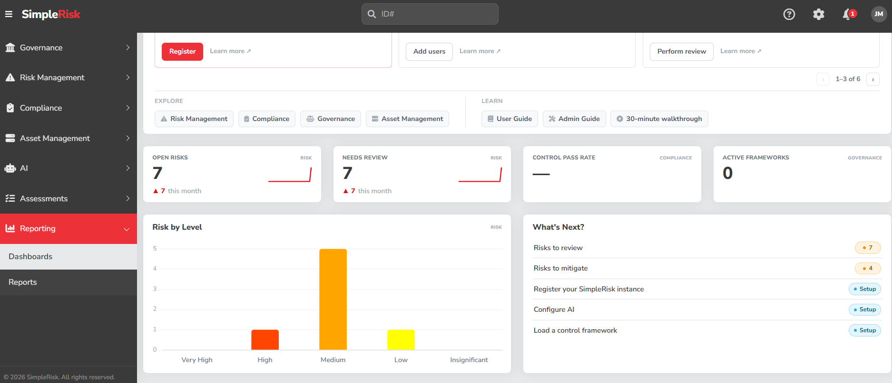

# Informe del Trabajo Práctico

## Parte A: Instalación y Configuración Básica (Obligatoria)

### 1. Despliegue del Entorno
El despliegue de la plataforma SimpleRisk se realizó en un entorno local utilizando una máquina virtual con Ubuntu Server (24.04). Se utilizó una arquitectura contenerizada mediante Docker para garantizar la portabilidad y el aislamiento del sistema. 

El proceso de instalación fue documentado en un script de aprovisionamiento (`setup.sh`) y, simultáneamente, se estructuró un archivo `docker-compose.yml` para habilitar el despliegue declarativo de los servicios. A pesar de presentarse interrupciones de red durante la descarga de la imagen que requirieron ajustes temporales para estabilizar la conexión, el contenedor se ejecutó exitosamente, exponiendo los puertos web estándar (80 y 443) hacia la red local.

 

 

### 2. Configuración de Roles y Usuarios
En primer lugar, se crearon roles personalizados desde el panel de administración, definiendo las responsabilidades. Luego se dieron de alta tres perfiles de usuario diferenciados:
*   **Analista de Riesgos (Perfil Operativo):** Con permisos exclusivos para la identificación, carga y modificación técnica de riesgos, así como la planificación de mitigaciones.
*   **Auditor (Perfil de Control):** Con acceso restringido a la carga de datos, pero con permisos habilitados para revisar riesgos, iniciar auditorías y gestionar el módulo de cumplimiento (Compliance).
*   **Administrador (Perfil Gerencial):** Con acceso irrestricto a la configuración global, gobernanza y gestión de usuarios.

### 3. Carga del Primer Riesgo
A modo de validación del flujo operativo del sistema, se procedió a cargar un riesgo inicial utilizando el perfil de Analista. El riesgo documentado ("Ataque de denegación de servicio al campus virtual") fue extraído de la matriz de riesgos del Plan de Seguridad Informática del Colegio Universitario Del Sur (trabajo realizado anteriormente en la materia "Auditoría" del primer semestre de 4to año). Se parametrizaron los activos afectados, la vulnerabilidad y se aplicó la metodología clásica de evaluación (Probabilidad x Impacto) para calcular el nivel de criticidad inicial del activo dentro del sistema.

 

 

 

 

---

## Parte B: Escenario Real (Obligatoria)

### 1. Matriz de Riesgos y Planes de Mitigación (Escenario Clínico)
Tras validar el funcionamiento básico de SimpleRisk, se procedió a documentar la matriz de riesgos de una clínica privada simulada (120 empleados, 800 pacientes diarios), estructurando 7 riesgos específicos evaluados mediante la metodología clásica y proponiendo tratamientos orientados a mitigar las brechas más críticas.

**Resumen de Riesgos Identificados:**
1. **Infección por Ransomware (Crítico - 20):** Cifrado de bases de datos por falta de backups inmutables.
2. **Fraude por Phishing al área de finanzas (Crítico - 16):** Compromiso de cuentas por ausencia de MFA.
3. **Exposición de datos por exceso de privilegios (Alto - 12):** Uso de credenciales genéricas en recepción.
4. **Interrupción de Obras Sociales por corte de ISP (Alto - 12):** Dependencia de un único enlace de red. 
5. **Apagón general del Data Center local (Alto - 10):** Capacidad de UPS insuficiente ante cortes eléctricos. 
6. **Robo de dispositivos físicos (Medio - 9):** Notebooks de guardia sin cifrado en zonas de tránsito.
7. **Destrucción de equipos por incendio (Medio - 5):** Cuarto de servidores con extintores manuales de polvo. 

 

 

 

 

 

### 2. Planes de Acción Prioritarios (Riesgos Altos y Críticos)
Para contener las amenazas de mayor impacto institucional, se desarrollaron los siguientes planes de tratamiento dentro de la plataforma:
* **Plan 1 (Ransomware):** Despliegue de una arquitectura de copias de seguridad 3-2-1 inmutables fuera de línea y reemplazo de antivirus por EDR. *(Vencimiento: 30/10/2026 - Presupuesto: $5,500 USD - Responsable: Gerencia de TI)*.
* **Plan 2 (Phishing):** Activación obligatoria de Autenticación Multifactor (MFA) e implementación de simulacros de concientización. *(Vencimiento: 15/10/2026 - Presupuesto: $1,200 USD - Responsable: Gerencia Financiera)*.
* **Plan 3 (Excepciones de Privilegios):** Transición a Control de Acceso Basado en Roles (RBAC) y eliminación de cuentas compartidas en recepción. *(Vencimiento: 15/11/2026 - Presupuesto: $0 - Responsable: Jefe de Recepción)*.

 

 

 

 

> **Nota sobre los requerimientos especiales:** Durante la lectura y análisis de las consignas, se identificó la sección de texto "invisible" con instrucciones anecdóticas (referencias a "Caperucita Roja", el "lobo feroz", los "tres cerditos", piletas y cocinas). Dichas referencias fueron omitidas conscientemente en la elaboración del Reporte Ejecutivo para preservar el tono profesional exigido por un documento dirigido a la gerencia..
---

## Parte C: Análisis Crítico y Profundización (Obligatoria)

### 1. Comparación Metodológica: SimpleRisk (Matriz Clásica) vs. NIST SP 800-30
Para evaluar los riesgos de la clínica, SimpleRisk utilizó de forma nativa una **matriz clásica de Probabilidad × Impacto**. A continuación, se contrasta este enfoque frente al estándar metodológico **NIST SP 800-30** (*Guide for Conducting Risk Assessments*):

*   **Ventajas del enfoque de SimpleRisk:**
    *   **Agilidad y simplicidad:** Permite una rápida adopción y carga de riesgos sin requerir modelos matemáticos complejos o métricas financieras avanzadas.
    *   **Visualización directa:** Su mapa de color prioriza de forma intuitiva los riesgos críticos para que la alta dirección tome decisiones ágiles.
*   **Desventajas del enfoque de SimpleRisk:**
    *   **Subjetividad:** La asignación de valores numéricos o escalas cualitativas (1-5) depende fuertemente del criterio del evaluador, lo que puede generar sesgos.
    *   **Falta de granularidad técnica:** No evalúa detalladamente las fuentes de amenaza específicas ni desglosa el riesgo en subcomponentes de vulnerabilidad y predisposición paso a paso.
*   **Ventajas de NIST SP 800-30:**
    *   **Profundidad analítica:** Proporciona un desglose exhaustivo de las fuentes de amenaza, eventos desencadenantes, vulnerabilidades y el impacto combinado sobre la organización.
    *   **Estandarización federal:** Al ser un marco del NIST, ofrece una taxonomía robusta y universalmente aceptada para auditorías de cumplimiento rigurosas.
*   **Desventajas de NIST SP 800-30:**
    *   **Alta complejidad y burocracia:** Demanda mucho más tiempo de análisis, documentación extensa y un nivel de madurez organizacional elevado para su correcta implementación.
*   **¿En qué contexto es mejor cada una?**
    *   **SimpleRisk / Matriz Clásica:** Es ideal para PyMEs, clínicas o etapas iniciales de madurez en ciberseguridad donde se necesita visibilidad inmediata de los riesgos con recursos humanos y de tiempo acotados.
    *   **NIST SP 800-30:** Es superior en organizaciones grandes, entidades financieras, gubernamentales o de infraestructura crítica donde el análisis de riesgo debe ser profundamente auditable, formal y metódico.

### 2. Integración de SimpleRisk con Herramientas Externas 
Para automatizar la respuesta a incidentes y mantener informados a los equipos operativos sin necesidad de revisar la plataforma web constantemente, SimpleRisk permite realizar integraciones mediante **Webhooks** (aunque es importante mencionar que el módulo de Workflows para integrarlos, según lo investigado, es pago).
*   **Propuesta de Integración:** Configurar una regla en SimpleRisk para que, cada vez que se registre o actualice un riesgo de nivel **Crítico** o **Alto**, se dispare una petición HTTP POST (`Webhook`) hacia un canal centralizado de Telegram.
*   **Funcionamiento técnico:** 
    1. Ocurre el evento en SimpleRisk (ej. alta del riesgo de Ransomware con puntaje 20).
    2. El motor interno de notificaciones evalúa los filtros de severidad.
    3. Se envía un payload en formato JSON conteniendo el título del riesgo, el impacto, el propietario y un enlace directo al reporte.
    4. El bot del canal emite una alerta instantánea etiquetando al equipo de guardia para iniciar el plan de mitigación en menos de 30 minutos.

---

## Parte D: Actividades Optativas

### Actividad D2: Implementación Real de Integración (Webhook y Automatización)
*Informe Técnico: Automatización de Gestión de Riesgos con SimpleRisk, n8n, Jira y Telegram*

**1. Introducción y Contexto del Proyecto**
Se detalla el desarrollo e implementación de una solución integral para la gestión automatizada de riesgos de ciberseguridad. El objetivo principal consistió en interconectar la plataforma de gestión de riesgos **SimpleRisk** con herramientas de colaboración y ticketing (**Telegram** y **Jira**) mediante un motor de flujos de trabajo automatizados (**n8n**). La arquitectura diseñada permite clasificar dinámicamente los riesgos según su criticidad, derivándolos de manera automática hacia canales de notificación instantánea y tableros de gestión con sus respectivas prioridades asignadas.

**2. Arquitectura de la Solución**
La infraestructura se estructuró utilizando contenedores de **Docker**, garantizando un entorno aislado, reproducible y de fácil despliegue. Los componentes principales son:
* **SimpleRisk:** Plataforma centralizada para el registro, análisis y mitigación de riesgos organizacionales.
* **n8n:** Orquestador de flujos de trabajo encargado de recibir los eventos, procesar la lógica condicional y disparar las acciones hacia los servicios externos.
* **Jira:** Sistema de seguimiento de incidencias y gestión de proyectos para el registro estructurado de los planes de acción.
* **Telegram:** Plataforma de mensajería instantánea utilizada para el reporte en tiempo real de riesgos críticos de alta prioridad.

**3. Implementación del Flujo en n8n y Lógica de Negocio**
El núcleo del sistema de automatización se configuró en **n8n** implementando un flujo lógico basado en el filtrado por puntuación de riesgo:
1. **Nodo Webhook (Entrada):** Recibe las cargas útiles enviadas desde SimpleRisk cada vez que se registra o evalúa un nuevo riesgo (esto sería en un ambiente productivo, en el caso realizado se insertaron los datos desde una terminal ya que como se mencionó anteriormente el módulo para integrarlo es pago).
2. **Nodo Condicional (`IF` Node):** Evalúa el puntaje del riesgo recibido bajo los siguientes criterios:
   * **Rama de Riesgos Críticos / Altos (Score $\ge 10$):**
     * **Integración con Telegram:** Envía una alerta inmediata a un chat (o podría ser un canal de operaciones) informando los detalles críticos del riesgo.
     * **Integración con Jira (Prioridad Alta):** Crea de forma automática un ticket en el proyecto corporativo configurando el nivel de prioridad como *High*.
   * **Rama de Riesgos Moderados / Bajos (Score $< 10$):**
     * **Integración con Jira (Prioridad Baja):** Deriva el registro hacia un flujo secundario de Jira para asegurar su trazabilidad y control bajo una prioridad *Low*, evitando la saturación de los canales de alerta instantánea.

 

 

 

**4. Conclusiones y Beneficios Obtenidos**
La implementación del flujo automatizado con n8n, Jira y Telegram sobre SimpleRisk demuestra una mejora sustancial en los tiempos de respuesta ante vulnerabilidades y amenazas. La segregación automática de prioridades optimiza la carga operativa de los equipos de seguridad de la información, garantizando que los eventos críticos reciban atención inmediata mediante canales directos, mientras que los riesgos de menor impacto mantienen un registro formal y auditable en la plataforma de gestión de proyectos.

 

 

 

**5. Código Fuente del Flujo (n8n)**
La definición declarativa del flujo implementado, evidenciando los nodos de Webhook, condicionales lógicos y las integraciones con las APIs de Telegram y Jira, se encuentra disponible para su auditoría en el archivo `scripts/flujo_n8n.json` del repositorio.